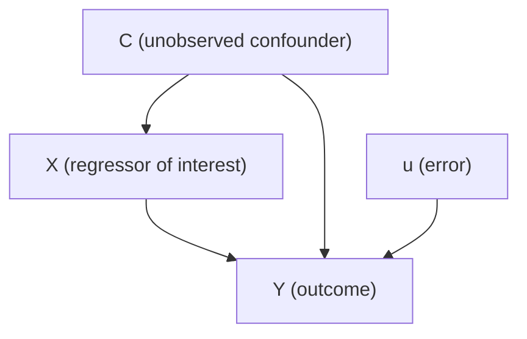
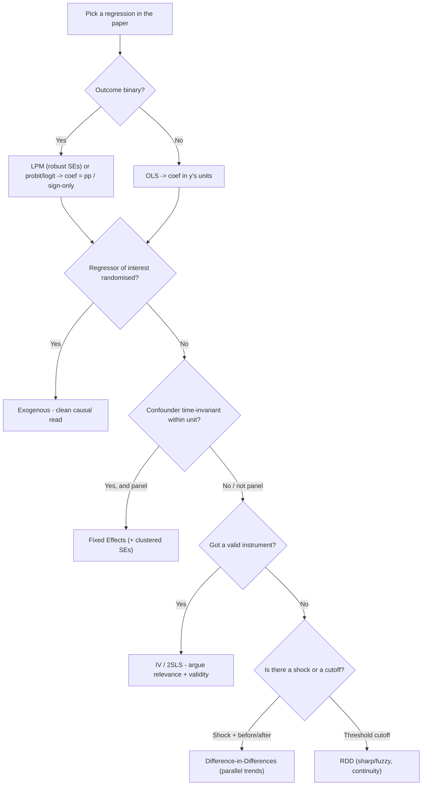

> Part of: [[Econometrics]]
> **Purpose:** Dembo hands out the experiment/paper a few days before the exam. The *experiment* changes every sitting; the *questions* almost never do. This note is the reusable skeleton — decode the variables, and the questions (and their answers) fall out automatically.
> Derived from: [[PP_01-Emotions & Risky Choice (Practice Exam)]] · [[PP_02-Holdup Game & Bargaining (2023 Moed A)]] · [[PP_03-Time Preferences & Discounting (2023 Moed B)]]
> Key concepts: [[_Econometrics Concepts#Linear Probability Model|Linear Probability Model]], [[_Econometrics Concepts#Causal Diagram|Causal Diagram]], [[_Econometrics Concepts#Endogeneity|Endogeneity]], [[_Econometrics Concepts#Omitted Variable Bias|Omitted Variable Bias]], [[_Econometrics Concepts#Fixed Effects|Fixed Effects]], [[_Econometrics Concepts#Instrumental Variables|Instrumental Variables]], [[_Econometrics Concepts#Difference-in-Differences|Difference-in-Differences]], [[_Econometrics Concepts#Probit Model|Probit Model]], [[_Econometrics Concepts#Marginal Effects|Marginal Effects]]

---

## 🎯 Big picture: the exam is always the same five moves

Every past paper runs the same arc. Whatever the costume (lotteries, bargaining, discounting), the questions test:

1. **What model is this?** → read the *outcome variable* (binary ⇒ [[_Econometrics Concepts#Linear Probability Model|LPM]]/probit/logit; continuous ⇒ OLS).
2. **What does each coefficient mean?** → sign, size, units, significance.
3. **Why is OLS wrong here?** → an omitted common cause / endogenous regressor ⇒ [[_Econometrics Concepts#Omitted Variable Bias|OVB]], drawn as a [[_Econometrics Concepts#Causal Diagram|DAG]].
4. **How do we fix it?** → [[_Econometrics Concepts#Fixed Effects|fixed effects]] (time-invariant confounder), [[_Econometrics Concepts#Instrumental Variables|IV]] (any endogenous regressor), or a natural experiment ([[_Econometrics Concepts#Difference-in-Differences|DiD]]/[[_Econometrics Concepts#Regression Discontinuity|RDD]]).
5. **Did the fix work / is it valid?** → relevance vs validity, parallel trends, overid tests, etc.

> [!tip] The single habit that wins marks
> **Classify every variable before you read the questions.** Outcome type and regressor type decide the model, the standard errors, and which "fix" the paper is steering toward. Do the triage table below first, on scrap paper, every time.

---

## 📝 Step 0 — Variable triage (do this the moment you get the paper)

For **every variable**, fill in four cells. This single table pre-answers ~60% of the exam.

| Variable | Outcome or regressor? | **Type** (binary / continuous) | **Randomised** by researcher, or **observed**? | **Time-varying** or fixed within unit? |
| --- | --- | --- | --- | --- |
| *(fill in)* | … | … | … | … |

What each column unlocks:

- **Binary outcome** ⇒ every `lm`/`feols`/`anova` on it is an [[_Econometrics Concepts#Linear Probability Model|LPM]]; coefficients are in **percentage points**; you **must** use [[_Econometrics Concepts#Robust Standard Errors|heteroskedasticity-robust SEs]] (LPM error is mechanically heteroskedastic). Continuous outcome ⇒ ordinary OLS.
- **Observed (not randomised) regressor** ⇒ suspect [[_Econometrics Concepts#Endogeneity|endogeneity]] ⇒ the question is fishing for [[_Econometrics Concepts#Omitted Variable Bias|OVB]] / IV. **Randomised/researcher-set regressor** ⇒ clean, exogenous, no bias story.
- **Fixed within unit** (a personality trait, a village, intrinsic preferences) ⇒ if it's the confounder and it's *unobserved*, the fix is [[_Econometrics Concepts#Fixed Effects|fixed effects]] (it demeans away). **Time-varying** confounder ⇒ FE won't save you; you need IV or a design.
- **Panel structure** (same unit over many rounds) ⇒ opens FE *and* requires [[_Econometrics Concepts#Clustered Standard Errors|clustered SEs]] (cluster at the unit level).

**How triage maps to the three past papers — the same four-column table, filled in.** Swap in the new paper's variable names and the answers fall out.

#### PP1 · Emotions & Risky Choice — panel: 243 subjects × 15 rounds

| Variable | Outcome or regressor? | Type | Randomised or observed? | Time-varying or fixed within unit? |
| --- | --- | --- | --- | --- |
| `chose.B` | outcome | binary | observed | time-varying |
| `diff.E` | regressor | continuous | researcher-set (lottery design) | time-varying (by round) |
| `emotion`, `energy` | regressor | continuous (1–7) | observed (self-report) | time-varying |
| `celsius`, `sleep` | regressor (IV candidates) | continuous | observed (natural variation) | time-varying |
| `risk.preferences` | omitted confounder | — | **unobserved** | **fixed within unit** |

> *Reading:* binary outcome ⇒ [[_Econometrics Concepts#Linear Probability Model|LPM]] (cluster SEs by subject — it's a panel). `emotion`/`energy` are observed and driven by the fixed, unobserved `risk.preferences` ⇒ [[_Econometrics Concepts#Omitted Variable Bias|OVB]] ⇒ [[_Econometrics Concepts#Fixed Effects|fixed effects]] (demeans the time-invariant trait) **or** [[_Econometrics Concepts#Instrumental Variables|IV]] (`celsius`, `sleep`). The Wed-final exam shock ⇒ [[_Econometrics Concepts#Difference-in-Differences|DiD]].

#### PP2 · Holdup Game — cross-section: 103 Buyer–Seller pairs (one game each)

| Variable | Outcome or regressor? | Type | Randomised or observed? | Time-varying or fixed within unit? |
| --- | --- | --- | --- | --- |
| `control` / `promises` / `threats` | regressor (dummies) | categorical | **randomised** (assigned) | — (cross-section) |
| `invest` | outcome (Stage 1) | binary | observed | — |
| `offer` | outcome (Stage 2) | continuous (0–100) | observed | **NA unless `invest`=1** |
| `accept` | outcome (Stage 3) | binary | observed | **NA unless `invest`=1** |

> *Reading:* `invest`/`accept` binary ⇒ [[_Econometrics Concepts#Linear Probability Model|LPM]] / [[_Econometrics Concepts#Logit Model|logit]]; `offer` continuous ⇒ OLS. Treatments randomised ⇒ clean (treatment coefficients are causal). But `offer`/`accept` exist only when `invest`=1 ⇒ [[_Econometrics Concepts#Endogenous Selection|endogenous selection]], and the sequential stages make earlier choices endogenous regressors for later ones. One game per pair ⇒ no panel / no FE.

#### PP3 · Time Preferences — panel: 178 subjects × 15 rounds (2,670 obs)

| Variable | Outcome or regressor? | Type | Randomised or observed? | Time-varying or fixed within unit? |
| --- | --- | --- | --- | --- |
| `choice` | outcome | continuous | observed | time-varying |
| `today.always`, `delay.always` | outcome | binary | observed | time-varying |
| `A.payment`, `A.delay` | regressor | continuous | **researcher-set** (each round) | time-varying |
| `income` | regressor | continuous | observed (2002 survey) | **fixed within unit** |
| subject's fixed traits | omitted confounder | — | **unobserved** | **fixed within unit** |

> *Reading:* `choice` continuous ⇒ OLS; `today.always` binary ⇒ [[_Econometrics Concepts#Linear Probability Model|LPM]] (robust SEs). `A.delay`/`A.payment` researcher-set ⇒ exogenous (clean). `income` is an observed survey covariate ⇒ [[_Econometrics Concepts#Endogeneity|endogenous]] ⇒ [[_Econometrics Concepts#Instrumental Variables|IV]]. Panel + unobserved fixed traits ⇒ OVB ⇒ fixed effects + cluster by subject.

---

## 📚 The question archetypes (with ready-to-adapt answers)

Each block: **when it shows up → what she asks → how to answer → traps.** Swap in the new paper's variable names.

### A · "What model / how do you interpret this coefficient?"

**Trigger:** any regression table. **Asks:** interpret $\hat\beta_j$, sign + magnitude + significance.

- **LPM** (binary outcome): $\hat\beta_j$ = change in the **probability** of $y=1$, in **percentage points**, for a one-unit rise in $x_j$ (others held fixed). A dummy regressor reads "vs the omitted base group."
- **Continuous OLS:** $\hat\beta_j$ = change in $y$ (in $y$'s units) per one-unit $x_j$.
- **Log forms** (if a variable is logged): log-dep ⇒ coefficient ×100 = **% change** in $y$; log-indep ⇒ /100 = effect of a **1% change** in $x$; log-log ⇒ **elasticity**.
- **Significance:** compare $|t|$ to **1.96** (5%) or read $p<0.05$. State the threshold explicitly.

🔧 $t = \hat\beta_j / \text{SE}(\hat\beta_j)$, and a 95% CI is $\hat\beta_j \pm 1.96\,\text{SE}$.

> [!warning] Traps
> Don't say "increases $y$ by $\beta$" for a binary outcome — say "increases the **probability** by $\beta$ percentage points." Always name the **base group** for a dummy. State "holding the other regressors fixed."

### B · "Run a joint test" — `anova()` / F-test

**Trigger:** two **nested** models, or "test whether these variables jointly matter." **Asks:** state $H_0$, conclude, say what it implies.

📝 $H_0:\beta_a=\beta_b=0$ vs $H_1:$ at least one $\neq 0$. Large $F$ ⇒ small $p$ ⇒ **reject** ⇒ the dropped variables jointly matter ⇒ leaving them out (the restricted model) pushes them into the **error term**, so the restricted model is under-specified / its error has a systematic component.

🔧 $F = \dfrac{(\text{RSS}_r - \text{RSS}_u)/q}{\text{RSS}_u/(n-k-1)}$, $q$ = number of restrictions. See [[_Econometrics Concepts#F-test|F-test]].

### C · "Draw the causal diagram" — DAG with a confounder

**Trigger:** "a colleague worries that…", "update the diagram". **Asks:** add the confounder and explain the backdoor path.

📝 Put the **unobserved common cause** $C$ with arrows into *both* a regressor $X$ **and** the outcome $Y$. That $X \leftarrow C \rightarrow Y$ structure is the **backdoor path** that biases $\hat\beta_X$. Name it, draw arrows, say "$C$ is unobserved so it sits in the error."

> [!tip] In the exam you **draw** this by hand — practise the $X \leftarrow C \rightarrow Y$ fork until it's muscle memory. Sequential/staged games (like the holdup game) are a special case: **earlier choices cause later ones**, so the stage order *is* the DAG.

### D · "What does this mean for the OLS estimate?" — OVB / endogeneity

**Trigger:** follows the DAG question. **Asks:** is $\hat\beta$ causal? Which direction is the bias?

📝 Because $C$ is omitted, $\text{Cov}(X,u)\neq 0$ ⇒ [[_Econometrics Concepts#Endogeneity|endogeneity]] ⇒ $\hat\beta_X$ is **biased and not causal**; it conflates $X\to Y$ with $C$'s effect. **Sign of bias** = sign(effect of $C$ on $Y$) × sign(corr of $C$ with $X$): both same sign ⇒ **upward** bias; opposite ⇒ **downward**. See [[_Econometrics Concepts#Omitted Variable Bias|Omitted Variable Bias]].

### E · "Why fixed effects here?" — panel confounder fix

**Trigger:** panel data + a **time-invariant** unobserved confounder (a trait, a village, a firm). **Asks:** why FE beats OLS, interpret FE coefficients.

📝 An [[_Econometrics Concepts#Individual Fixed Effect|individual fixed effect]] $a_i$ is a per-unit intercept that **absorbs everything constant within the unit** — including the unobserved confounder. The [[_Econometrics Concepts#Within Estimator|within estimator]] **demeans** each unit, so anything fixed within it ($C_i - \bar C_i = 0$) is annihilated. Identification now comes from **[[_Econometrics Concepts#Within Variation|within variation]]** ("how the *same* unit changes round to round"). Coefficients are interpreted relative to the unit's own average.

> [!warning] Traps
> Put the FE at the level where the confounder is **constant** (subject `| ID`, not day). FE only kills **time-invariant** confounders — a time-varying one survives. Cluster SEs at the FE level. FE can't estimate the effect of a variable that never changes within a unit (it's collinear with $a_i$).

### F · "Interpret the probit/logit" — and the LPM-vs-probit contrast

**Trigger:** `glm(... family = binomial)`. **Asks:** interpret coefficients; contrast with LPM.

📝 In [[_Econometrics Concepts#Probit Model|probit]]/[[_Econometrics Concepts#Logit Model|logit]] you can read **sign and significance only** — the coefficient is **not** the [[_Econometrics Concepts#Marginal Effects|marginal effect]]. The effect on the probability is non-constant: $\beta_j\,\phi(\mathbf{x}'\beta)$ (probit), steep near $P=0.5$, flat at the tails. To get a magnitude you evaluate $\phi(\cdot)$ at a chosen point (e.g. means). Estimated by [[_Econometrics Concepts#Maximum Likelihood Estimation|MLE]], not OLS.

> [!tip] Easy-marks contrast
> **LPM coefficient = the marginal effect** (constant, in pp) but can predict $P\notin[0,1]$. **Probit/logit** is bounded in $[0,1]$ but the coefficient ≠ marginal effect. That trade-off is a recurring question.

### G · "Propose / evaluate an instrument" — IV & 2SLS

**Trigger:** an endogenous regressor (observed, correlated with $u$). **Asks:** write the IV, judge relevance and validity.

📝 You need **≥ 1 instrument per endogenous regressor**. Two conditions:

- **[[_Econometrics Concepts#Instrument Relevance|Relevance]]:** $\text{Cov}(z,X)\neq 0$ — **testable** (first-stage correlation / F-stat; F < 10 ⇒ [[_Econometrics Concepts#Weak Instruments|weak]]).
- **[[_Econometrics Concepts#Instrument Validity|Validity]] / exclusion:** $\text{Cov}(z,u)=0$ — **not testable** from data (u is unobserved); you must **argue** it (z affects Y *only through* X). A correlation table can show relevance but **never proves validity**.

🔧 `fixest`: `feols(y ~ exog | endog ~ z1 + z2, data, se = "hetero")`. [[_Econometrics Concepts#First Stage|First stage]]: regress each endogenous $X$ on all instruments + exogenous regressors; [[_Econometrics Concepts#Second Stage|second stage]] uses fitted $\hat X$.

> [!tip] Extra IV diagnostics she likes
> **[[_Econometrics Concepts#Overidentifying Restrictions Test|Sargan/overid test]]** (only when #instruments > #endogenous): $H_0$ = instruments valid; reject ⇒ at least one invalid. **[[_Econometrics Concepts#Wu-Hausman Test|Wu-Hausman]]:** $H_0$ = regressor exogenous (OLS fine); reject ⇒ endogeneity confirmed, use IV.

### H · "Find the natural experiment" — Difference-in-Differences

**Trigger:** a shock/event hitting some units but not others, with before/after data. **Asks:** define groups & periods, compute DiD, state the assumption.

📝 **Treatment** = units hit by the shock; **Control** = units not hit. **Pre** = before; **Post** = after. The estimate nets out the common trend:

🔧 $\hat\delta = (\bar Y_{T,post}-\bar Y_{T,pre}) - (\bar Y_{C,post}-\bar Y_{C,pre})$ — the difference of the two changes. As a regression (gives a **standard error**): $Y = \beta_0 + \delta_0\,\text{post} + \beta_1\,\text{treat} + \delta_1(\text{post}\times\text{treat}) + u$, where the **interaction $\delta_1$ = the DiD estimate**.

> [!warning] Identifying assumption
> **[[_Econometrics Concepts#Parallel Trends Assumption|Parallel trends]]:** absent the shock, both groups would have moved by the same amount (untestable directly). Also check no *other* shock hit either group at the same time, and groups are otherwise comparable. The estimand is the [[_Econometrics Concepts#Average Treatment Effect on the Treated|ATT]].

### I · "Treatment switches at a threshold" — RDD (less common, be ready)

**Trigger:** treatment determined by a **cutoff** in a running variable (age, score, vote share). **Asks:** sharp vs fuzzy, the jump, bandwidth.

📝 [[_Econometrics Concepts#Sharp RDD|Sharp]]: treatment goes 0→1 cleanly at the [[_Econometrics Concepts#Cutoff|cutoff]]; effect = **jump in $Y$** at the cutoff ($\beta_2$ on the treatment dummy). [[_Econometrics Concepts#Fuzzy RDD|Fuzzy]]: crossing only shifts the **probability** ⇒ estimate by IV ([[_Econometrics Concepts#Wald Estimator|Wald estimator]] = jump in Y / jump in treatment prob). [[_Econometrics Concepts#Continuity Assumption|Continuity]]: absent treatment $Y$ would pass smoothly through the cutoff. Checks: [[_Econometrics Concepts#McCrary Density Test|McCrary]] (no sorting), [[_Econometrics Concepts#Placebo Test|placebo]] (covariates don't jump). Smaller [[_Econometrics Concepts#Bandwidth|bandwidth]] = less bias, more variance.

### J · "Outcome only observed for some units" — sample selection

**Trigger:** a variable is **NA unless** an earlier binary outcome = 1 (e.g. `offer` exists only if `invest`=1). **Asks:** is the sub-sample regression biased?

📝 If who is *in* the sample depends on unobservables that also affect the outcome, that's [[_Econometrics Concepts#Endogenous Selection|endogenous selection]] ⇒ [[_Econometrics Concepts#Sample Selection Bias|sample-selection bias]] — the conditional regression isn't causal. Conceptually fixed by a [[_Econometrics Concepts#Heckman Selection Model|Heckman]] two-step ([[_Econometrics Concepts#Inverse Mills Ratio|inverse Mills ratio]] in stage 2; significant λ ⇒ selection confirmed).

### K · "Which standard errors?" — the SE question

📝 **LPM** (binary outcome) ⇒ always **[[_Econometrics Concepts#Robust Standard Errors|robust]]** (error variance depends on $X$). **Panel / repeated obs per unit** ⇒ **[[_Econometrics Concepts#Clustered Standard Errors|clustered]]** at the unit level (serial correlation within unit). **Time series** ⇒ [[_Econometrics Concepts#HAC Standard Errors|HAC/Newey-West]]. Default homoskedastic SEs are almost never right in this course.

---

## 🧭 Decision tree — from the new paper to the answer

---

## ✍️ Universal mark-grabbers (the grader's checklist)

- **Always write the error term** $u_{it}$ and use the right **subscripts** ($i$ for unit, $t$ for round) — panels lose a mark for either omission.
- **State $H_0$ and $H_1$ explicitly** before concluding any test.
- **Name the base/omitted group** for every dummy.
- For binary outcomes say **"probability… percentage points,"** never just "$y$ increases."
- Distinguish **testable vs assumed**: relevance/overid are testable; validity/parallel-trends/exclusion are **assumptions you argue**.
- When you give a "fix," say **what bias it removes and why** (e.g. "FE demeans the time-invariant trait, breaking $\text{Cov}(X,u)$").
- Round-trip every claim to the **research question**: end with "…so this answers RQ(x): yes/no, because…".

---

## 🔁 How to use this note before & during the exam

1. **When the paper drops:** do **Step 0 triage** on every variable. Then walk the **decision tree** once per regression the paper shows.
2. **Pre-exam drill:** for each archetype A–K, write the one-paragraph answer using the *new* paper's variable names. If you can fill all of them, you've pre-written the exam.
3. **Predict her questions:** she almost always asks (i) interpret a coefficient, (ii) draw a confounder DAG, (iii) diagnose OVB/endogeneity, (iv) propose FE **or** IV, (v) judge the fix, (vi) find a DiD shock. Map each to a part of the new paper in advance.

---

## 📎 Related Notes

- Worked past papers: [[PP_01-Emotions & Risky Choice (Practice Exam)]] · [[PP_02-Holdup Game & Bargaining (2023 Moed A)]] · [[PP_03-Time Preferences & Discounting (2023 Moed B)]]
- Reference: [[_Exam Formula Sheet (Lec 1-10)]] · [[_Econometrics Concepts]]
- Lectures: [[Lec_02-Linear Probability Model (LPM)]] · [[Lec_03-Logit & Probit Models]] · [[Lec_04-Instrumental Variables]] · [[Lec_08-Fixed Effects in Panel Data]] · [[Lec_09-Regression Discontinuity Design (RDD)]] · [[Lec_10-Difference-in-Differences]]
- Hub: [[Econometrics]]
