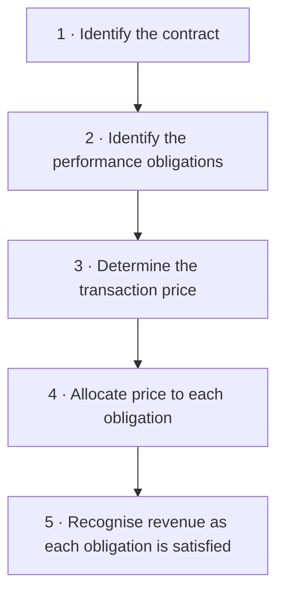
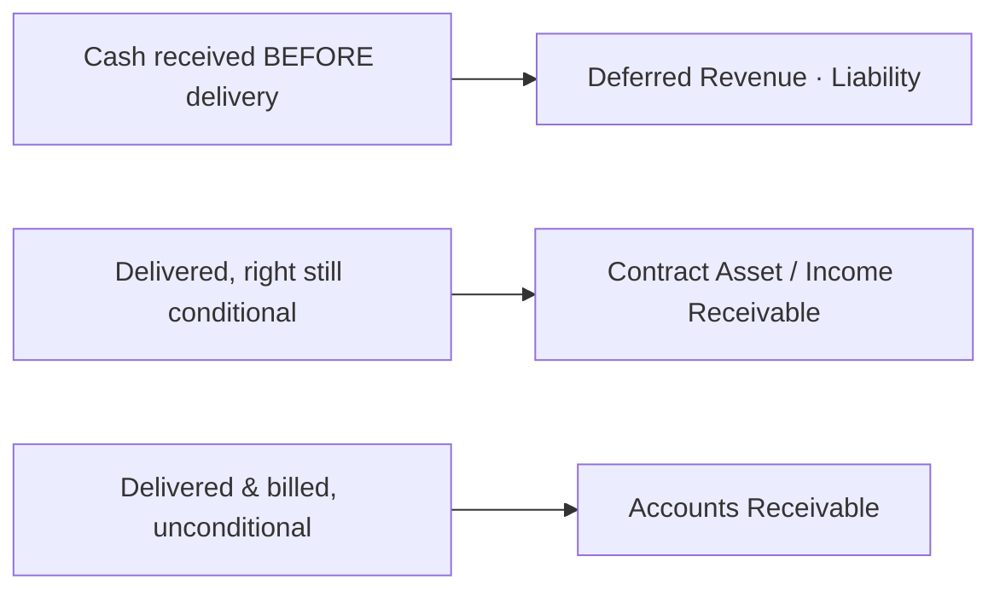

# Session 8 — Revenue Recognition

> Part of: [[Accounting]]
> When — and how much — revenue a company is allowed to record, under the ASC 606 / IFRS 15 five-step model
> Key concepts: [[Revenue Recognition]], [[ASC 606]], [[IFRS 15]], [[Performance Obligation]], [[Transaction Price]], [[Variable Consideration]], [[Standalone Selling Price]], [[Transfer of Control]], [[Deferred Revenue]], [[Accounts Receivable]]

> [!note] Slide numbering
> The deck's title slide reads "Session 10 — Revenue Recognition" (the lecturer's running count). It is the **8th** set of notes in this vault and the file is named accordingly.

---

## 1. Why Revenue Recognition Matters

==Revenue is the single most scrutinised line in the financial statements.== Investors anchor valuations to it, management is incentivised on it, and auditors test it hardest. That sensitivity creates two opposite risks the standards exist to police:

| Risk | Question it answers | Failure looks like |
|------|--------------------|--------------------|
| **Completeness** | Did we record *all* the revenue we earned? | Understated revenue, hidden sales |
| **Accuracy** | Did we record the *right amount*, in the *right period*? | Channel-stuffing, premature recognition, inflated sales |

> [!info] Order to Cash vs Revenue Recognition
> These are two different processes that run in sequence — don't conflate them.
>
> - ==Order to Cash (O2C)== is an **operating process**: it starts with the order/booking, continues through delivering the goods or services, and ends with collecting cash.
> - ==Revenue Recognition== is an **accounting process** that *follows* O2C and, using a set of standards, decides **when** revenue can actually be recorded in the books.
>
> Cash moving and revenue being recognised are **not** the same event — this is the heart of [[Accrual Accounting]].

---

## 2. The Standards: ASC 606 / IFRS 15

==ASC 606== (US GAAP) and ==IFRS 15== (international) are the converged standards governing revenue. They replaced dozens of industry-specific rules with **one principle**: recognise revenue to depict the transfer of promised goods or services in an amount that reflects the consideration the entity expects to be entitled to.

Both standards implement that principle through the same **five-step model**:

> [!tip] How to remember the five steps
> **Contract → Promises → Price → Split → Deliver.** You find the deal, list what you promised, work out what you'll be paid, divide that across the promises, then book revenue only as you actually hand each promise over.

---

## 3. Step 1 — Identify the Contract

A ==contract== only counts for revenue purposes if **all five** criteria are met:

1. The parties have **approved** the contract and are committed to it.
2. Each party's **rights** regarding the goods/services can be identified.
3. The **payment terms** can be identified.
4. The contract has **commercial substance** (it will change the entity's future cash flows).
5. It is **probable** the consideration will actually be **collected**.

> [!warning] Collectibility is a gate, not an afterthought
> If it is *not* probable you'll get paid, you do **not** have a contract under Step 1 — and therefore **no revenue**, even if you've delivered. This is the criterion that catches sales to financially shaky customers.

### 3.1 Two complications

| Complication | What it is | Subscription example |
|--------------|-----------|----------------------|
| **Combination of contracts** | Agreements signed at/near the same time may be treated as **one** contract | Tested via negotiation as a package, price interdependence, or shared goods/services |
| **Contract modification** | A change to scope and/or price | Up/down in subscriber count; expansion/reduction of term or features |

> [!example] Worked Scenario A — The shaky customer (slide 6)
> You sign a contract to sell software to a startup in an economically unstable region whose financial health is highly questionable at signing.
>
> **Analysis:** Step 1 criterion 5 (collectibility) is likely **failed**. Even though both sides "agreed", it is not *probable* you will collect. → **No contract, no revenue yet.** Recognise revenue only as cash is received, or once collectibility becomes probable.

> [!example] Worked Scenario B — The secret side letter (slide 6)
> A salesperson signs a standard master agreement but secretly emails the client: *"if you can't get budget approval in 60 days, cancel with no penalty."*
>
> **Analysis:** The side letter is part of the real contract. A free cancellation right means the parties are **not truly committed** (criterion 1 fails) and the rights/obligations are not what the paperwork says. → **No enforceable contract until the 60-day window passes.** Booking revenue now would be premature.

---

## 4. Step 2 — Identify the Performance Obligations

A ==performance obligation (PO)== is a promise to transfer a **distinct** good or service to the customer. A good or service is **distinct** only if it passes **both** tests:

> [!info] The two-part "distinct" test
> 1. **Capable of being distinct** — the customer can benefit from it *on its own* (use it, resell it, or hold it for value), possibly together with resources readily available to them.
> 2. **Distinct within the contract** — the promise is *separately identifiable* from other promises; it is not highly integrated with, dependent on, or modified by another item.
>
> Fail **either** test and the item cannot stand alone — it must be **bundled** with other goods/services until you have a distinct bundle.

| Phrase | Plain meaning |
|--------|---------------|
| "Benefit on a standalone basis" | Customer can use, resell, or hold the item to generate value by itself |
| "Separately identifiable" | The item isn't so integrated/customised by another component that it's useless alone |

> [!example] Worked Scenario C — Software licence + integration (slide 8)
> A company sells an enterprise software licence **and** a separate professional-services package to customise and integrate it into the client's legacy IT.
>
> **Analysis:** If the licence is genuinely usable on its own → **two POs** (licence + service), recognised separately. But if the licence is **useless without** the specialised integration, the two are not separately identifiable → **one combined PO**, recognised together.

> [!example] Worked Scenario D — Renewal discount option (slide 8)
> A 1-year subscription at standard pricing includes: *"on renewal you may renew at a 50% discount."*
>
> **Analysis:** The deep renewal option gives the customer a ==material right== they wouldn't get otherwise. That option is itself a **separate performance obligation** — part of the transaction price must be allocated to it and deferred until the renewal year (or until the option lapses).

---

## 5. Step 3 — Determine the Transaction Price

The ==transaction price== is the consideration the entity expects to be **entitled to** in exchange for the goods/services. It looks obvious ("the price in the contract") but several features make it **variable** and require estimation:

- Discounts, rebates, credits, refunds
- Volume-based discounts (lower per-unit price as quantity rises)
- Performance incentives / bonuses
- Milestone payments
- Price concessions / adjustments

> [!info] Estimating Variable Consideration
> When consideration is variable you must **estimate** it using whichever better predicts the amount:
>
> - ==Expected value== — probability-weighted average (good for many similar contracts).
> - ==Most likely amount== — the single most probable outcome (good for binary outcomes, e.g. a bonus you either hit or miss).

> [!warning] The constraint on variable consideration
> You may only include variable amounts to the extent it is **highly probable** that a significant revenue **reversal will not occur** later. When in doubt, recognise **less** now — booking optimistic variable amounts that later reverse is exactly the abuse the constraint prevents.

> [!example] Worked Scenario E — Retroactive volume rebate (slide 10)
> Baseline $100/unit, but *"if you buy more than 10,000 units this year, the price retroactively drops to $80 for all units."*
>
> **Analysis:** This is variable consideration. Estimate whether the 10,000 threshold is likely. If it's probable they'll hit it, recognise revenue at the **$80** rate from the start (constrained estimate), not $100 — otherwise you'd over-recognise and reverse later.

> [!example] Worked Scenario F — Performance bonus (slide 10)
> Fixed fee $80,000 to build a platform, **plus** $20,000 bonus *"if it passes final beta before November 1st."*
>
> **Analysis:** The $20k is variable (binary → use **most likely amount**). Include it in the transaction price **only if** it's highly probable the deadline will be met. If genuinely uncertain, constrain it out and recognise just the $80k until the bonus becomes probable.

---

## 6. Step 4 — Allocate the Price to Each Obligation

When a contract has multiple POs, you cannot arbitrarily decide how much goes where. Allocation is done in proportion to each obligation's ==Standalone Selling Price (SSP)== — the price you'd charge if you sold that item separately.

> [!info] SSP hierarchy
> 1. **Observable SSP** — the actual price when sold separately (best evidence).
> 2. If no observable price, **estimate** it via:
>    - **Adjusted market assessment** — look at what competitors charge, adjust for your market/position.
>    - **Expected cost plus margin** — work out your cost to deliver, add a reasonable margin.
>    - **Residual approach** — *only* in narrow cases (highly variable/uncertain price): take total price, subtract the known SSPs of the other items, allocate whatever's left.

> [!example] Worked Scenario G — Phone + data plan bundle (slide 13)
> Smartphone SSP $1,000, 2-year data plan SSP $1,000 → total standalone value **$2,000**. Bundle promo price **$1,200** (an $800 discount).
>
> **Allocation by relative SSP:** the $800 discount is spread *pro-rata*:
>
> | Obligation | SSP | Weight | Allocated price |
> |---|---|---|---|
> | Smartphone | $1,000 | 50% | **$600** |
> | 2-year data plan | $1,000 | 50% | **$600** |
> | **Total** | $2,000 | 100% | **$1,200** |
>
> The phone's $600 is recognised at delivery (point in time); the data plan's $600 is recognised **over** the 24 months.

> [!example] Worked Scenario H — "Free" support bundled with a licence (slide 13)
> A perpetual on-prem licence sells for $10,000, *"includes 1 year of technical support and patches for free."*
>
> **Analysis:** Support is **not** free — it's a distinct PO. Allocate the $10,000 across the licence and the support by their SSPs (e.g. licence SSP $9,000, support SSP $1,000 → recognise ~$9,000 at delivery and ~$1,000 ratably over the support year). Nothing is ever truly "free" in rev rec.

---

## 7. Step 5 — Recognise Revenue as Control Transfers

Revenue is recognised when ==control== of the good/service passes to the customer. Control transfers either at a **point in time** (typical for goods) or **over time** (typical for services/subscriptions).

> [!info] Five indicators that control has transferred (point in time)
> 1. The customer has **accepted** the product.
> 2. The entity has a **present right to payment**.
> 3. **Legal title** has passed.
> 4. The customer bears the **risks and rewards** of ownership.
> 5. The customer has **physical possession**.

> [!tip] Over time vs point in time
> Recognise **over time** if any of these hold: the customer simultaneously receives and consumes the benefit (e.g. a subscription); the entity creates/enhances an asset the customer controls; or the asset has **no alternative use** to the entity *and* the entity has an **enforceable right to payment** for work done to date. Otherwise, wait for the specific **point in time** when control transfers, using the five indicators as a checklist.

> [!example] Worked Scenario I — Bill-and-hold bagel oven (slide 15)
> A custom oven is finished Sept 25; delivery was due Oct 1, but the client asks you to **store it and bill now** because their site is delayed.
>
> **Analysis:** This is a ==bill-and-hold== arrangement. Revenue *can* be recognised before physical delivery **only if** strict conditions are met: the reason is substantive (customer requested it), the goods are **identified separately** as the customer's, they're **ready to transfer**, and you **cannot use or redirect** them. If those hold → recognise now. Otherwise → wait until delivery.

> [!example] Worked Scenario J — Acceptance-certificate machine (slide 15)
> A complex machine is delivered Nov 15, but *"the transaction is not final until the client runs a 30-day QA test and signs an Acceptance Certificate."*
>
> **Analysis:** Control has **not** transferred at delivery — the formal **customer-acceptance** condition is substantive and the customer can still reject. Defer revenue until the acceptance certificate is signed (≈ Dec 15), unless you can objectively demonstrate the criteria are already met.

---

## 8. The Balance Sheet Accounts Rev Rec Creates

The timing gaps between *delivering*, *invoicing*, and *collecting* produce four distinct accounts. Knowing which one applies is a common exam test.

| Account | Side | Definition | Trigger |
|---------|------|-----------|---------|
| ==Deferred Revenue== | **Liability** | Obligation to provide future goods/services for which cash was **already received** | Paid upfront, not yet delivered |
| ==Income Receivable== (contract asset) | **Asset** | A **conditional** right to consideration (still depends on something, e.g. future performance) | Delivered, but right to bill not yet unconditional |
| ==Accounts Receivable== | **Asset** | An **unconditional** right to cash from the customer | Delivered **and** billed; only time stands between you and the cash |
| ==Cost to Obtain a Contract== | **Asset** | Incremental costs of winning the contract (e.g. sales commissions) | **Capitalised** and amortised over the contract life, not expensed upfront |

> [!tip] Conditional vs unconditional is the whole game
> The difference between a **contract asset** (income receivable) and a **receivable** is whether your right to the money is still **conditional** on doing something more. Once only the *passage of time* remains, it becomes a plain **Accounts Receivable**.

---

## 📚 Summary

| Step | Question | Key rule |
|------|----------|----------|
| **1 · Contract** | Is there a real, enforceable, collectible deal? | All 5 criteria — collectibility must be *probable* |
| **2 · Obligations** | What distinct promises did we make? | Both "distinct" tests; bundle if either fails |
| **3 · Price** | How much do we expect to be entitled to? | Estimate variable consideration; apply the **constraint** |
| **4 · Allocate** | How is the price split? | Relative **Standalone Selling Price** |
| **5 · Recognise** | When has control transferred? | Point in time (goods) vs over time (services); 5 control indicators |

| Concept | Core idea |
|---------|-----------|
| **O2C vs Rev Rec** | Operating process vs accounting process — cash ≠ revenue |
| **Collectibility** | Not probable → no contract → no revenue |
| **Variable consideration** | Expected value or most-likely amount, constrained against reversal |
| **SSP** | The basis for splitting a bundled price |
| **Control** | The trigger for recognition, not cash and not invoicing |
| **Deferred Revenue** | Liability — paid but not yet delivered |
| **Contract asset vs AR** | Conditional right vs unconditional right to cash |

---

## Related Notes

- [[Accounting]] — subject hub
- [[Session 2 - Accounting Fundamentals]] — accrual accounting and cut-off accounts underpin all of rev rec
- [[Session 5 - Financial Statements Analysis]] — where the revenue line gets analysed (growth, margins, SaaS metrics)
- [[Session 9 - Recap]] — exercises 9–13 apply this five-step model
- [[_Wiki-Link Registry]] — concept-link tracker
