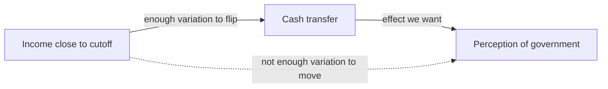

# Regression Discontinuity Design (RDD)

> Part of: [[Econometrics]]
> **Lecture 09** — Applied Econometrics, Dr. Aluma Dembo
> Key concepts: [[Regression Discontinuity]], [[Running Variable]], [[Cutoff]], [[Bandwidth]], [[Continuity Assumption]], [[Sharp RDD]], [[Fuzzy RDD]], [[McCrary Density Test]], [[Placebo Test]], [[Local Average Treatment Effect]], [[Instrumental Variables]], [[Wald Estimator]]

---

## 🎯 The Big Idea

**Regression discontinuity design** exploits a situation where treatment is assigned by a hard rule: whether you cross a ==threshold value of some variable==. People who land *just* on either side of that threshold are essentially identical — same backgrounds, same motivations — yet one group gets treated and the other does not. Any jump in the outcome at the threshold must therefore be caused by the treatment.

> [!tip] Why RDD is so credible
> The whole design rests on a simple fact: **no one can perfectly control which side of the cutoff they land on.** An applicant who scores 1199 on a test with a 1200 cutoff is, for all practical purposes, the same as one who scored 1200 — but only one gets the scholarship. The cutoff manufactures something close to random assignment in a narrow window.

---

## 🪙 Motivating Example: Cash Transfers in Uruguay

**Paper**: Manacorda, Miguel & Vigorito (2011)

A large anti-poverty program in Uruguay gave a cash transfer to households **at or below an income threshold**.

**Question**: What is the effect of the program on people's *perception of the government*? (Do they think it is better than, the same as, or worse than the previous government?)

The dataset records, for each individual:

| Variable | Meaning |
|---|---|
| `Income_centered` | Income **centered at the cutoff** (i.e. `running − cutoff`) |
| `Education` | Years of education |
| `Age` | Age in years |
| `Participation` | =1 if eligible for the transfer, =0 if not |
| `Support` | Government rating: 0 = worse, 0.5 = same, 1 = better than previous govt |

> [!warning] Naive comparison is confounded
> You cannot just compare the government-support of people who got the transfer vs. those who didn't. Income causes *both* transfer receipt *and* perception of government (poorer people may view government differently for many reasons). Income is a confounder.

### The causal logic of restricting to the cutoff



By restricting analysis to incomes **very close to the cutoff**, there is still enough variation in income to flip treatment status on/off, but *not* enough variation in income to independently move the outcome. The confounding path through income is shut down.

---

## 🧱 Core Terminology

> [!info] The three building blocks
> - **==Running variable==** (a.k.a. forcing variable): the variable that determines treatment (income, test score, age, vote share).
> - **==Cutoff==**: the threshold value of the running variable that decides who gets treated.
> - **==Bandwidth==**: the window around the cutoff within which observations are treated as essentially comparable to each other (despite some being treated and some not).

### The continuity assumption

> [!info] Continuity Assumption (the identifying assumption)
> **Without** the treatment, the outcome would have evolved **smoothly** through the cutoff. Nothing else jumps discontinuously at the threshold. Therefore *any* jump in the outcome at the cutoff is attributable to the treatment alone.

This is what makes the design work, and it is credible precisely because individuals cannot perfectly sort across the cutoff.

### RDD identifies a LOCAL effect

> [!warning] Internal validity vs. external validity trade-off
> RDD identifies the treatment effect **only for observations near the cutoff** — this is the [[Local Average Treatment Effect]]. We learn the effect for people *at the threshold*, not for everyone.
>
> - **Strong internal validity**: the comparison is highly credible.
> - **Weak external validity**: the estimate may not generalize to observations far from the cutoff.
>
> RDD buys a credible comparison at the cost of a narrow, local answer. (Next week, [[Difference-in-Differences]] makes a different trade-off — comparison over time rather than across a threshold.)

---

## 📐 The Sharp RDD Regression

We estimate one regression that **allows different intercepts *and* different slopes** for treated vs. untreated observations. The trick is the interaction term:

$$
Y = \beta_0 + \beta_1(\text{Running} - \text{cutoff}) + \beta_2\,\text{Treated} + \beta_3\big[\text{Treated}\cdot(\text{Running}-\text{cutoff})\big] + u
$$

where:
- **Running − cutoff**: the running variable, centered so that 0 corresponds to the threshold.
- **Treated**: binary indicator (=1 above the cutoff in this example; sometimes it's below — depends on the policy).
- $\beta_2$: the **vertical jump** at the cutoff.
- $\beta_3$: the **change in slope** at the cutoff.

> [!tip] Why center the running variable at the cutoff?
> Centering means the intercept is evaluated *at the cutoff* (where Running − cutoff = 0), not at Running = 0. This is what lets $\beta_0$ and $\beta_0 + \beta_2$ represent the two lines' heights *exactly at the threshold* — which is the only place the comparison is valid.

### Deriving the treatment effect

Split the single regression into its two implied lines.

**Untreated observations** (Treated = 0):
$$
\hat{Y} = \hat\beta_0 + \hat\beta_1(\text{Running} - \text{cutoff})
$$
At the cutoff (Running − cutoff = 0) the predicted value is $\hat\beta_0$.

**Treated observations** (Treated = 1):
$$
\hat{Y} = \hat\beta_0 + \hat\beta_1(\text{Running} - \text{cutoff}) + \hat\beta_2 + \hat\beta_3(\text{Running} - \text{cutoff})
$$
At the cutoff the interaction and slope terms vanish, leaving $\hat\beta_0 + \hat\beta_2$.

**The gap between the two lines at the cutoff** is the treatment effect:
$$
\boxed{(\hat\beta_0 + \hat\beta_2) - \hat\beta_0 = \hat\beta_2}
$$

So the **coefficient on the treatment dummy, $\hat\beta_2$, is the RDD estimate** — the jump at the cutoff.

![[Lec09_sharp_rdd_gap.png|560]]

> [!example] Reading the picture
> Two separate fits — blue below the cutoff (Treated = 0), red above (Treated = 1). They are allowed to have different slopes and intercepts. The **green double-arrow at the cutoff** is $\hat\beta_2$: the discontinuous jump. Everything away from the cutoff just helps us *project the lines* to the threshold accurately.

---

## 🪙 Back to Uruguay: estimating the jump

Applied to the cash-transfer data, the model is:

$$
\text{Support} = \beta_0 + \beta_1\,\text{Income\_centered} + \beta_2\,\text{Participation} + \beta_3\big[\text{Income\_centered}\cdot\text{Participation}\big] + u
$$

> [!warning] Here the treated group is BELOW the cutoff
> In this program, people with income **below** the cutoff are the ones who receive the transfer, so `Participation = 1` below the threshold. RDD doesn't care which side is treated — only that treatment switches at the cutoff.

A visual check shows a clear discontinuity in government support right at the income cutoff:

![[Lec09_uruguay_support.png|560]]

The estimated jump is $\hat\beta_2 = 0.0999$ — receiving the cash transfer raises government support by about **0.10 on the 0–1 scale** for households near the threshold.

> [!question] Worked check (do this yourself)
> 1. What is the model for **treated** observations, and its predicted value at the cutoff? → $\hat\beta_0 + \hat\beta_2$.
> 2. What is the model for **untreated** observations, and its predicted value at the cutoff? → $\hat\beta_0$.
> 3. What is the treatment effect? → $\hat\beta_2 = 0.0999$.

---

## 🚨 Threats to Validity

### 1. Sorting (manipulation of the running variable)

> [!warning] When RDD breaks
> RDD fails if people can **manipulate the running variable** to land on the side they want. Example: if students can re-take a test *indefinitely* until they just clear a scholarship cutoff, then those just above differ systematically from those just below (more persistent, more motivated). The two groups are no longer comparable and the [[Continuity Assumption]] fails.
>
> **Rule of thumb**: a little *noise* in the running variable is fine; *precise control* near the cutoff is the problem.

### 2. The McCrary density test — checking for sorting

> [!info] McCrary Density Test
> If people sort across the cutoff, we'd see **too many observations bunching** on the favorable side. The McCrary test checks whether the *number of observations* (the density) is smooth through the cutoff.
> - A **jump in the density** is evidence of manipulation. ⚠️
> - A **smooth density** is reassuring (though not proof).
>
> In R: `rddensity(x = running_var, c = cutoff)`

### 3. The placebo test

> [!info] Placebo Test
> Replace the outcome with **control variables that should *not* be affected** by the cutoff (e.g. age, pre-determined characteristics) and confirm there is **no jump**. If a covariate that treatment can't possibly influence still jumps at the cutoff, something other than treatment is discontinuous there — a red flag for the design.

> [!tip] Density test vs. placebo test — what's the difference?
> The **density test** asks whether the *amount of data* jumps at the cutoff (are people piling up on one side?). The **placebo test** asks whether *predetermined characteristics* jump at the cutoff (are the two groups already different before treatment?). Both probe the continuity assumption from different angles.

---

## 🎚️ Two Modelling Decisions: Bandwidth & Functional Form

Every RDD requires two choices:

1. **Bandwidth** — how close to the cutoff should we look?
2. **Functional form** — is a straight line the right fit, or do we need polynomials?

![[Lec09_bandwidth.png|640]]

> [!warning] Why these choices matter
> If the underlying relationship is **curved** but you fit a straight line over a **wide** window, the curvature gets mistaken for a jump — biasing $\hat\beta_2$. Two fixes: (a) shrink the **bandwidth** so that, locally, a line is a good approximation; or (b) use a more flexible **functional form**. Restricting the bandwidth often gives very different — and more credible — estimates than using the full sample.

### Flexible functional form

$$
Y = \beta_0 + f(\text{Running} - \text{cutoff},\ \text{Treated}) + \beta_2\,\text{Treated} + u
$$

where $f(\cdot)$ is a flexible function that may include polynomials.

### Second-order polynomial specification

$$
\begin{aligned}
Y = \beta_0 &+ \beta_1(\text{R}-c) + \beta_2(\text{R}-c)^2 + \beta_3\,\text{Treated} \\
&+ \beta_4\big[(\text{R}-c)\cdot\text{Treated}\big] + \beta_5\big[(\text{R}-c)^2\cdot\text{Treated}\big] + u
\end{aligned}
$$

Adding the quadratic terms (and their interactions with Treated) gives the model more flexibility to fit curvature on each side of the cutoff. The jump at the cutoff is still read off the **coefficient on Treated** ($\beta_3$ here).

> [!warning] Don't over-fit with high-order polynomials
> Very high-order polynomials can produce wild, spurious jumps at the boundary. The modern applied standard prefers **local linear** regression in a small, data-driven bandwidth over global high-order polynomials.

---

## 💻 Estimating RDD in R

### Method 1 — Interacted OLS (the model above, written as code)

```r
library(fixest)

# Center the running variable at the cutoff first:
df$run_c   <- df$running - cutoff
df$treated <- as.integer(df$running >= cutoff)

# RDD as an interacted regression:
# Y = b0 + b1*run_c + b2*treated + b3*treated:run_c + u
m <- feols(y ~ run_c * treated, data = df)
summary(m)
# b2 (coef on `treated`) = treatment effect at the cutoff.
```

The `run_c * treated` syntax expands to `run_c + treated + run_c:treated`, giving exactly the four-term sharp RDD model.

### Method 2 — `rdrobust` (the modern applied standard)

Local linear regression with a **data-driven bandwidth** and **robust confidence intervals**:

```r
library(rdrobust)

# Local linear RDD, automatic bandwidth, robust inference:
m <- rdrobust(y = df$y, x = df$run_c, c = 0)
summary(m)

# See the data-driven bandwidth it chose:
summary(rdbwselect(y = df$y, x = df$run_c, c = 0))

# Quick visual (binned scatter + fits):
rdplot(y = df$y, x = df$run_c, c = 0)
```

> [!tip] How to read `rdrobust` output
> - **Coef (Conventional)** — the size of the jump = the estimated effect.
> - **Robust row** — the p-value you should actually *report* (bias-corrected inference).
> - **BW est. (h)** — the bandwidth it chose.
> `rdbwselect()` reports the optimal data-driven bandwidth, so you aren't choosing the window by hand.

---

## 🍺 Worked Example: Drinking Age & Mortality

> [!example] Minimum legal drinking age (a textbook *sharp* design)
> Turning 21 makes it legal to drink in the US. Does mortality jump right at that birthday?
> - **Running variable**: age (centered at 21)
> - **Cutoff**: age 21
> - **Treatment**: legally allowed to drink — switches *cleanly* at 21 (so it's **sharp**)
> - **Outcome**: mortality per 100,000
>
> No one turns 21 a little early, so **there is no sorting** — the design is clean by construction.

![[Lec09_drinking_age.png|560]]

```r
library(rdrobust)
mlda <- read.csv("mlda.csv")
rdrobust(y = mlda$mortality, x = mlda$age_c, c = 0) |> summary()
```

**Result**: mortality rises by about **+8.24 per 100,000** at age 21 — the vertical gap at the cutoff.

> [!success] Robustness to bandwidth = a reassuring sign
> A good RDD estimate should **not swing wildly** as you change the window around the cutoff. Re-estimating the drinking-age effect at several bandwidths keeps the estimate close to **+8 per 100,000** — exactly what you want to see.

---

## 🌫️ Sharp vs. Fuzzy RDD

So far treatment switched cleanly at the cutoff (**sharp**). Often, crossing the cutoff only **changes the *likelihood*** of treatment — this is a **fuzzy** design.

| | **Sharp RDD** | **Fuzzy RDD** |
|---|---|---|
| At the cutoff | Treatment probability jumps **0 → 1** | Treatment probability jumps by **less than 1** |
| Treatment assignment | Deterministic given the cutoff | Probabilistic — cutoff only *nudges* take-up |
| What you estimate | Jump in outcome = treatment effect | Jump in outcome **÷** jump in treatment prob. |
| Estimator | Interacted OLS / local linear | **IV / Wald estimator** at the cutoff |
| Example | Drinking age (21 = legal, period) | Admission cutoffs (scoring above ≠ guaranteed enrolment) |

### Fuzzy RDD = Instrumental Variables at the cutoff

> [!info] The fuzzy design *is* an IV problem
> When crossing the cutoff only raises the *probability* of treatment, "being above the cutoff" is an **instrument** for "actually receiving treatment":
> - **Instrument**: being above the cutoff
> - **Endogenous treatment**: actually receiving the treatment
> - **Estimate**: the [[Wald Estimator]] —
>
> $$\boxed{\text{effect} = \dfrac{\text{jump in outcome at cutoff}}{\text{jump in treatment probability at cutoff}}}$$
>
> This is **reduced form over first stage** — exactly the IV ratio. The result is the [[Local Average Treatment Effect]]: the effect for **compliers** near the cutoff (those induced to take up treatment by crossing it).

### Worked Example: Flagship University & Earnings (Hoekstra 2009)

> [!example] Hoekstra (2009)
> **Question**: What is the effect of attending a flagship state university on future earnings? SAT-score cutoffs determine *eligibility*, but scoring above the cutoff doesn't *guarantee* you enrol — so this is **fuzzy**.

The estimate comes from **two jumps** at the SAT cutoff:

![[Lec09_fuzzy_two_jumps.png|640]]

- **First stage (left)**: the probability of *enrolling* at the flagship jumps at the cutoff.
- **Reduced form (right)**: *log earnings* jump at the cutoff too.
- The **ratio** of the two jumps is the effect: students just above the cutoff earn about **9.5% higher wages** than those just below.

```r
library(rdrobust); library(fixest)

# Fuzzy RDD with rdrobust: pass the take-up variable to `fuzzy =`
rdrobust(y = hoek$log_earnings, x = hoek$sat_c,
         c = 0, fuzzy = hoek$enrolled) |> summary()

# Same thing as 2SLS (above_cutoff instruments enrolled):
feols(log_earnings ~ sat_c | enrolled ~ above_cutoff,
      data = subset(hoek, abs(sat_c) <= 100)) |> summary()
```

> [!warning] Always report the first-stage strength
> Near the cutoff, the **first stage can be weak** (the jump in treatment probability is small), which inflates standard errors — the classic [[Weak Instruments]] problem. Always check: *is the jump in treatment probability large?* and report it alongside the estimate.

---

## 🗳️ Recitation: Close Elections & Party Voting

**Paper**: Cattaneo, Frandsen & Titiunik (2015) — *do politicians vote with their party or their voters?*

> [!info] The setup
> In the US House, whoever wins **>50% of the vote share** takes the seat. In **close elections** (winner near 50%), the winning party is *almost random*. So we can ask: when a Democrat barely beats a Republican, does the representative's voting record jump?
> - **Running variable**: lagged Democratic vote share
> - **Cutoff**: 0.50
> - **Treatment** (`Republican`): indicator that the representative is a Republican
> - **Outcome** (`Score`): ADA "liberal voting" index, 0–100 (higher = more liberal), from ~25 high-profile roll-call votes per Congress, 1946–1995

If representatives vote **with their voters**, the ADA score should change *smoothly* with vote share (a barely-Democratic district ≈ a barely-Republican district). If they vote **along party lines**, the score should **jump** discontinuously at the 50% cutoff.

### Recitation task — what to report

For each specification, report the estimated **jump**, its **standard error**, and **one sentence** interpreting it:

1. **Interacted OLS, no bandwidth restriction**: `feols(y ~ run_c * treated)`.
2. **Restrict to a bandwidth of 0.02** around the cutoff and re-estimate.
3. **Add a second-order polynomial** in the running variable.
4. **Compare with `rdrobust`'s data-driven bandwidth.** Which would you trust, and why?

> [!question] The discussion question
> Do politicians vote with their **party** or their **voters**? A large discontinuity in the ADA score at the 50% cutoff implies that *who wins* (party), not *the electorate's preferences*, drives policy — because the electorates on either side of a razor-thin election are nearly identical, yet voting records diverge.

---

## 🎯 Summary

1. **RDD** uses a treatment rule based on a cutoff in a **running variable**. Units just above vs. just below are comparable, so a **jump in the outcome at the cutoff = the treatment effect**.

2. The identifying assumption is **continuity**: absent treatment, the outcome would pass smoothly through the cutoff. It's credible because units can't *perfectly* control which side they land on.

3. RDD gives a **local** estimate (strong internal validity, limited external validity) — the effect for units *at the threshold*.

4. **Sharp RDD** is an interacted OLS: $Y = \beta_0 + \beta_1(\text{R}-c) + \beta_2\text{Treated} + \beta_3[\text{Treated}\cdot(\text{R}-c)] + u$, and the jump is $\hat\beta_2$ — the coefficient on the treatment dummy.

5. **Threats**: *sorting/manipulation* of the running variable. Diagnose with the **McCrary density test** (does the amount of data jump?) and a **placebo test** (do predetermined covariates jump?).

6. Two key choices: **bandwidth** (how local?) and **functional form** (line vs. polynomial). Use a **data-driven bandwidth** (`rdrobust` / `rdbwselect`) and check the estimate is stable across bandwidths.

7. **Fuzzy RDD**: the cutoff only changes the *probability* of treatment → it's an **IV problem**. The **Wald estimator** = (jump in outcome) / (jump in treatment probability) = reduced form / first stage = the **LATE** for compliers. Always report first-stage strength.

---

## 📎 Related Notes

- Previous: [[Lec_08-Fixed Effects in Panel Data]] — panel data, within-estimator, fixed effects
- Next: [[Difference-in-Differences]] — comparison over time rather than across a threshold
- Hub: [[Econometrics]]
- IV link: [[Lec_04-Instrumental Variables]] — fuzzy RDD is IV at the cutoff ([[Wald Estimator]], [[Local Average Treatment Effect]], [[Weak Instruments]])
- Key concepts: [[Regression Discontinuity]], [[Running Variable]], [[Cutoff]], [[Bandwidth]], [[Continuity Assumption]], [[Sharp RDD]], [[Fuzzy RDD]], [[McCrary Density Test]], [[Placebo Test]]
