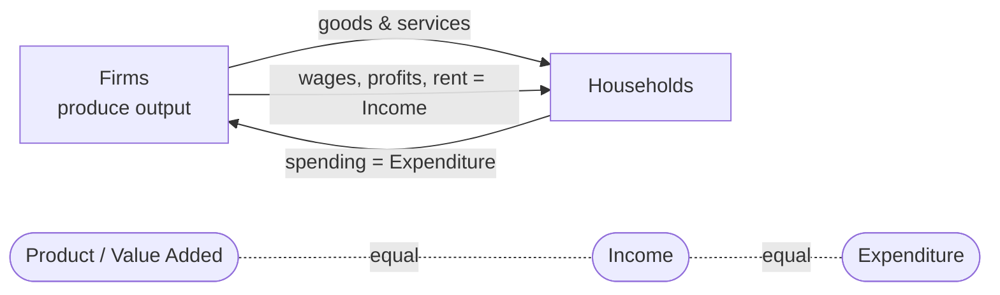

# Macro Data — A Review

> Part of: [[Macro-Economics]]
> Key concepts: [[GDP]], [[GNP]], [[Real vs Nominal]], [[GDP Deflator]], [[CPI]], [[Business Cycles]], [[Fisher Equation]], [[Purchasing Power Parity]]

---

## 🎯 Measurement of Economic Activity

Three equivalent approaches to measuring the size of an economy:

| Approach | What it counts |
|---|---|
| **Product** | Value added — output minus intermediate inputs |
| **Income** | Wages + capital income + firm profits |
| **Expenditure** | Total spending by final purchasers |

> [!info] The core identity
> $$\text{Production} = \text{Income} = \text{Expenditure}$$
> Every unit of output produced is purchased by someone and generates income for someone. The three approaches are just different accounting views of the same circular flow.

*The circular flow: the same money measured at three points — output sold, income paid, spending received.*

---

## 📊 Gross Domestic Product (GDP)

GDP is the single most-used measure of economic activity — correlated with standard of living, unemployment, fiscal deficits, and inflation.

### The national accounts identity

$$\underbrace{Y}_{\text{total output}} = \underbrace{C}_{\text{consumption}} + \underbrace{I}_{\text{investment}} + \underbrace{G}_{\text{govt. purchases}} + \underbrace{NX}_{\text{net exports}}$$

### Expenditure components

- **$C$** — households buying new goods and services.
- **$I$** — capital used for future production (including inventory changes).
- **$G$** — government purchases of goods and services (excludes transfer payments).
- **$NX$** — exports minus imports.

### Value added vs. final goods

> [!example] Coffee chain
> Farmer sells beans for \$1 → roaster sells for \$2.20 → shop sells espresso for \$3.
>
> | Stage | Value added |
> |---|---|
> | Farmer | \$1 |
> | Roaster | \$1.20 |
> | Coffee shop | \$0.80 |
> | **Sum** | **\$3** |
>
> The final good is the \$3 espresso. GDP = \$3 by both the value-added and expenditure approach. **Don't double-count intermediates.**

---

## 🔀 GDP vs. GDI — Do Approaches Align?

**GDI** (Gross Domestic Income) should equal GDP in theory. In practice (US, 1947–2025), discrepancies are **not small** and come from:

- Government transfers (e.g., COVID-era stimulus mismeasurement).
- Corporate earnings bursts.
- Individuals misreporting (e.g., booking capital gains as income).

> [!tip] Which to use?
> Customarily we use GDP, but an emerging suggestion is to average the two. Recent debate: GDI has run above trend while GDP has run below — the gap matters for policy.

---

## 🚫 What GDP is NOT

1. **Not easily comparable across countries** — population size and purchasing-power differences distort raw comparisons.
2. **Not a measure of everything valuable** — excludes:
   - Home production, black-market activity
   - Environmental quality, crime/safety
   - Income (in)equality
3. **Not welfare** — in theory we'd measure welfare with a utility function; GDP is just a (strongly correlated) proxy.

![[l1_hdi_vs_gdp.png|560]]
*HDI vs. GDP per capita across countries (2021). Strongly correlated, but with wide dispersion — many countries sit well above or below the income-predicted line.*

### The Human Development Index (HDI)

$$\text{HDI} = (\text{Life Expectancy index})^{1/3} \cdot (\text{Education index})^{1/3} \cdot (\text{Income index})^{1/3}$$

Still criticised (why those three? why equal weights?) but a better proxy for living standards than GDP alone.

### Jones & Klenow (2016)

Model-based welfare measure integrating **consumption + leisure + life expectancy + inequality**. Inequality matters "behind the veil of ignorance" — captures risk faced by a randomly-drawn citizen.

- Finding 1: welfare and income are **highly correlated**.
- Finding 2: but with **huge dispersion** around the 45° line — many countries are richer or poorer in welfare terms than their GDP suggests.

---

## 💵 Nominal vs. Real GDP

### Why the distinction matters

Nominal GDP for period $t$:

$$Y^{nom}_t = \sum_i p_{i,t}\,q_{i,t}$$

If nominal GDP rises, we can't tell whether quantities grew, prices grew, or both. **Real GDP strips out price changes** to isolate quantity changes.

![[l1_real_vs_nominal.png|560]]
*Nominal vs. real GDP, USA (real in 2017 dollars, so the lines cross in 2017). With positive inflation, nominal sits above real after the base year and below it before.*

### Fixed-weight real GDP

Pick a base year, fix prices at that year's level, let quantities vary.

> [!example] Base year = 2010
> | Year | Nominal GDP | Real GDP (2010 \$) |
> |---|---|---|
> | 2010 | \$12,000 | \$12,000 |
> | 2020 | \$22,500 | \$19,000 |
> | Growth | 87.5% | **58.3%** |
>
> **Base year = 2020** instead gives real growth of **60.71%** — different answers from the same data!

> [!warning] The base-year problem
> Choice of base year materially changes growth estimates, especially when relative prices shift quickly. A partial fix: **chain-weighting.**

### Chain-weighted growth rate

Geometric average of growth rates computed with both years' prices:

$$g_{Y,t} = \left[\frac{\sum_i p_{i,t-1}\,q_{i,t}}{\sum_i p_{i,t-1}\,q_{i,t-1}} \cdot \frac{\sum_i p_{i,t}\,q_{i,t}}{\sum_i p_{i,t}\,q_{i,t-1}}\right]^{0.5} - 1$$

In the example above: **$g_Y = 59.51\%$** — smoothly between the two fixed-weight answers.

Building real GDP from chain-weighted growth rates:

$$Y_{\text{real},t+1} = (1 + g_{t+1})\,Y_{\text{real},t}$$

---

## 📈 Average Growth Rates

Geometric average over $t$ periods with constant growth $\bar{g}$:

$$y_t = (1 + \bar{g})^t y_0 \quad \Rightarrow \quad \bar{g} = \left(\frac{y_t}{y_0}\right)^{1/t} - 1$$

> [!example] Doubling in 40 years
> $y_{2020} = 200$, $y_{1980} = 100$: $\bar{g} = (200/100)^{1/40} - 1 = 1.75\%$.

### Catch-up / doubling questions

Given $\bar{g}$, how long to multiply output by factor $X$?

$$t = \frac{\ln X}{\ln(1 + \bar{g})}$$

Used to answer *"if two countries grow at different rates, will they ever converge?"* — substitute in the ratio you want and solve for $t$.

---

## 🌍 GDP vs. GNP

- **GNP** = income earned by the nation's factors of production, **wherever located**.
- **GDP** = income earned by factors located **within the domestic economy**, regardless of nationality.

$$\text{GNP} = \text{GDP} + \text{NFP}$$

where $\text{NFP}$ (Net Factor Payments) = payments from abroad to domestic citizens minus payments to foreigners residing domestically.

> [!example] The Ireland case (2019)
> Ireland's GNP was **21% below** its GDP because of foreign multinationals booking profits there. For small open economies with heavy foreign-owned capital, GDP overstates the income that actually flows to nationals.

---

## 🔁 Business Cycles — Trend vs. Cycle

Each observation decomposes into:

$$Y_t = \underbrace{Y_t^{trend}}_{\text{expected growth}} + \underbrace{Y_t^{cycle}}_{\text{deviation from trend}}$$

### Extracting the trend — HP filter

Use the **Hodrick–Prescott filter** with smoothing parameter $\lambda = 1{,}600$ (quarterly data). Other methods (band-pass, one-sided filters) give similar pictures.

![[l1_business_cycle.png|600]]
*Trend/cycle decomposition of US log GDP (HP filter, λ=1,600). Top: log GDP vs. its smooth trend. Bottom: the cyclical component — deviations from trend that define booms and recessions.*

### Cyclical diagnostics

Once we have $Y_t^{cycle}$, compute its **correlation with other series' cyclical components**:

| Correlation sign | Label |
|---|---|
| $+$ | Pro-cyclical (e.g., consumption, investment) |
| $-$ | Counter-cyclical (e.g., unemployment) |
| $\approx 0$ | Acyclical |

Also compare **standard deviations**: durables fluctuate more than non-durables; investment fluctuates much more than consumption.

> [!tip] Recurring toolkit
> These cyclical statistics (correlation with GDP + relative volatility) are used throughout the course — see [[Lec_02-Consumption and Saving]] for the stylised facts on $C$.

---

## 💹 Price Indexes and Inflation

### Definitions

A **price index** is the average price level of a basket relative to a base year. **Inflation** is the percentage change in the index:

$$\pi_{t+1} = \frac{P_{t+1} - P_t}{P_t} = \frac{\Delta P_{t+1}}{P_t}$$

### The GDP deflator

$$\text{GDP Deflator} = \frac{\text{Nominal GDP}}{\text{Real GDP}}$$

Depends on the choice of base year and weighting rule (fixed vs. chain-weighted).

### Consumer Price Index (CPI)

Current price of a fixed **consumption basket** relative to its base-year price. Three practical problems:

1. Picking the representative basket — it evolves over time and across regions.
2. Quality improvements — is last year's phone "the same good" as this year's?
3. New products — how to introduce them into the basket.

### Personal Consumption Expenditure (PCE) deflator

$$\text{PCE} = \frac{\text{Nominal Consumption}}{\text{Real Consumption}}$$

Like the GDP deflator for the consumption sub-aggregate, but with a changing basket (unlike fixed-basket CPI).

### Which index covers what?

| Measure | Capital goods | Imports | Basket |
|---|---|---|---|
| **GDP deflator** | ✅ (if home-produced) | ❌ | Changes implicitly |
| **CPI** | ❌ | ✅ | Fixed |
| **PCE deflator** | ❌ | ✅ | Changes |

---

## 💱 Exchange Rates and Purchasing Power

### The problem

GDP is measured in local currency. To compare across countries we need a common unit — typically USD. But the **nominal exchange rate** (e.g., ~3.1 ILS per USD) does a poor job reflecting differences in what the money can buy.

### Purchasing Power Parity (PPP)

Compare the cost of the **same basket** in local currency across countries:

$$e^{pp} = \frac{\text{Price in country }i}{\text{Price in the US}}$$

Then convert to common units:

$$\text{GDP}^{\text{PPP}}_i = \frac{\text{GDP}^{\text{local}}_i}{e^{pp}}$$

Data source: [Penn World Tables](https://www.rug.nl/ggdc/productivity/pwt/?lang=en).

> [!warning] The comparability problem never goes fully away
> How do we know the "representative basket" is really the same in two different countries? Different datasets can give quite different PPP numbers.

---

## 💸 Nominal and Real Interest Rates

### The Fisher equation

$$1 + r = \frac{1 + i}{1 + \pi} \approx i - \pi$$

where $i$ = nominal rate, $\pi$ = inflation, $r$ = real rate. The approximation holds when $i, \pi$ are small.

### Ex-post vs. ex-ante

**Ex-post (realised):** use actual inflation.
**Ex-ante (expected):**

$$\mathbb{E}[r] = i - \pi^e$$

What households and firms actually care about when making decisions — the expected real return.

> [!tip] Interest rates are prices
> An interest rate is the price of moving consumption (or capital) across time. This frames the whole [[Lec_02-Consumption and Saving]] problem — the real interest rate $r$ is the price that appears in the Euler equation.

---

## 🎯 Summary — What This Lecture Teaches

1. **GDP = income = expenditure** — three equivalent measurement approaches, with non-trivial discrepancies in practice (GDP vs. GDI).
2. **GDP is a proxy for welfare, not welfare itself** — HDI and Jones–Klenow give richer pictures.
3. **Real vs. nominal** matters: fixed-weight indexes are base-year sensitive; **chain weighting** is the standard fix.
4. **Average growth rates** use geometric means; the $(1+\bar{g})^t = y_t/y_0$ formula answers catch-up and doubling questions.
5. **GNP vs. GDP** can diverge sharply for small open economies (Ireland).
6. **Business cycles** are deviations from an HP-filtered trend; cyclical correlation + relative volatility are the core diagnostics.
7. **GDP deflator, CPI, PCE deflator** differ in basket coverage (capital goods, imports) and weighting rules.
8. **PPP exchange rates** beat nominal rates for cross-country comparison, but aren't perfect.
9. **Fisher equation** $r \approx i - \pi$ connects nominal and real rates — the real rate is the relevant price for intertemporal decisions.

---

## 📎 Related Notes

- Companion: [[Lec_02-Consumption and Saving]] — uses the cyclical facts established here
- Foundational: [[National Accounts]], [[HP Filter]], [[Inflation]], [[Exchange Rates]]
- Future applications: [[Fiscal Policy]], [[Monetary Policy]], [[Growth Models]]
