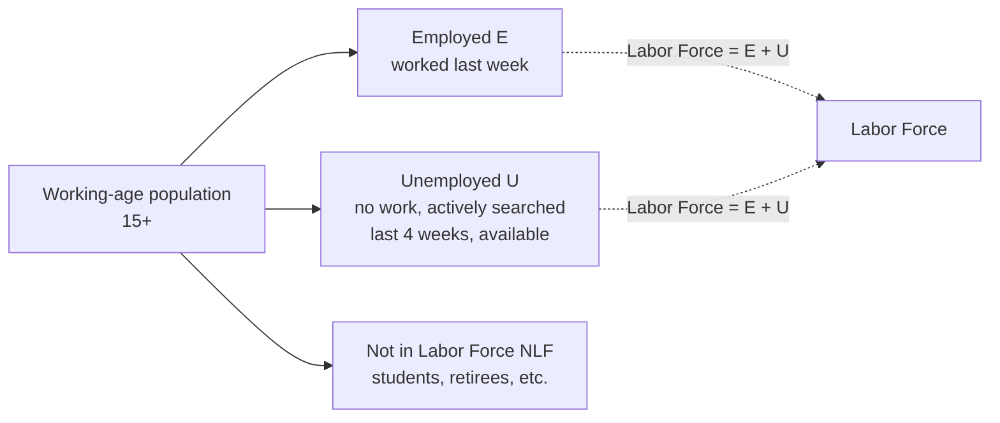
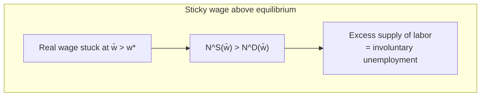

# Labor Market Data, Participation & Unemployment

> Part of: [[Macro-Economics]]
> **Lecture 08** — Macro-Economics, "The Labor Market, Part II"
> Key concepts: [[Unemployment Rate]], [[Labor Force Participation]], [[EPOP]], [[Sticky Wages]], [[Frictional Unemployment]], [[Stocks and Flows Model]], [[Job Finding Rate]], [[Separation Rate]]

---

## 🗺️ Where This Fits

[[Lec_07-Labor Market]] built a **frictionless** labor market: every worker willing to work at the market wage $w^*$ finds a job, so there is no unemployment in equilibrium. That is useful for thinking about employment *quantities* over the cycle, but it cannot speak to the thing people actually care about — **unemployment**.

This lecture does two things:

1. **Measurement** — the labor-market "aggregates" ($E$, $U$, participation) are subtler than GDP because they come from *surveys* and depend on definitions. We need to know what the numbers mean before we model them.
2. **A first model of unemployment** — since the baseline model generates none, we bolt on a simple *two-state stocks-and-flows* description driven by a ==job-finding rate $f$== and a ==separation rate $d$==. This is the gateway to modern search-and-matching theory.

---

## 📋 Where the Data Comes From

Labor-market aggregates are **survey-based**, not administrative counts. In the US:

| Survey | Unit | Size | Measures |
|---|---|---|---|
| **Current Population Survey (CPS)** | Households | ~60,000 households | Unemployment rate, participation, flows |
| **Current Employment Statistics (CES)** | Businesses / establishments | ~121,000 firms & gov't agencies, ~631,000 worksites | Net job gain/loss, payroll employment |

> [!warning] Household vs. establishment surveys can disagree
> Because the two surveys sample different units (people vs. firms), they can paint different pictures of the same month — a recurring headache when reading "the jobs report."

---

## 🧮 The Three Labor-Market States

Every person aged 15+ is classified into exactly one of three groups:

- ==**Employed (E)**== — worked full- or part-time during the past week (or was on sick leave, vacation, or strike).
- ==**Unemployed (U)**== — *without work*, **actively sought work in the past four weeks**, and *available* for work. **This active-search requirement is exactly what the frictionless model is missing.**
- ==**Not in Labor Force (NLF)**== — did not work and did not look (students, retirees, homemakers).

### Key Ratios

$$\boxed{\text{Participation rate} = \frac{E + U}{\text{working-age population}}}$$

$$\boxed{\text{Unemployment rate} \quad u = \frac{U}{U + E}}$$

$$\boxed{\text{Employment-Population ratio (EPOP)} = \frac{E}{\text{working-age population}}}$$

> [!tip] Why three different measures, not one?
> The unemployment rate has the labor force ($E+U$) in the denominator, so a person who **gives up searching** moves from $U$ to $NLF$ and *mechanically lowers* $u$ — even though nothing good happened. EPOP and participation use the whole population in the denominator, so they don't have this blind spot. Reading all three together avoids being fooled.

> [!example] The "recovered yet?" trap (Great Recession)
> The same recovery can look *complete* through the unemployment rate, *partial* through EPOP, and *worrying* through the participation rate — because people who exit the labor force drop out of $u$ entirely. The lecture shows three FRED charts of the same episode telling three different stories. Always ask which measure is being quoted.

International comparisons (OECD, prime-age 25–54) show large and persistent gaps in EPOP, unemployment, and participation across the US, Germany, UK, Israel, and Australia — and big differences by **gender**, with female participation rising substantially over 1970–2020.

---

## ⚠️ Sources of Unemployment

The frictionless model says anyone willing to work at $w^*$ is employed. Reality disagrees. Three standard stories:

### 1. Sticky Wages (Wage Rigidity)

Suppose a negative productivity shock should lower the equilibrium wage, but the wage **cannot fall** (minimum wages, unions, costly renegotiation, efficiency wages, firms avoiding turnover). Then the wage is stuck **above** market-clearing and labor supply exceeds labor demand — the gap is involuntary unemployment.

In the labor-supply/demand diagram, fixing $\bar w > w^*$ gives employment $N^D(\bar w)$ (demand-determined) while $N^S(\bar w)$ workers want jobs; the horizontal gap $N^S - N^D$ is unemployment.

> [!warning] Rigidity only "works" in one direction
> Downward wage rigidity creates unemployment **only if** the sticky wage sits *above* equilibrium. A wage stuck *below* equilibrium produces excess **demand** (labor shortage), not unemployment. So this story needs wages rigid on the *downward* side specifically.

> [!question] Are wages actually rigid?
> Hotly debated empirically. It matters whether we mean **real or nominal** wages, whether we look at **new hires** (whose wages are more flexible) vs. continuing workers, and aggregate data mask huge composition/selection effects. Not a settled question.

### 2. Structural Unemployment

Mismatch from **reallocation** across regions or industries — a worker's skills are in the wrong place or the wrong sector. Historically concentrated among lower-skilled workers (an open question whether that persists with AI/automation — see [[Lec_09-Inequality & Polarization]]).

### 3. Frictional Unemployment

Even with the "right" number of jobs, **searching for work, searching for workers, and matching are all costly and take time.** People are unemployed *in transit* between jobs. The clearest evidence: **vacancies and unemployment coexist** — there are large numbers of job openings *at the same time* as large numbers of unemployed workers, which a frictionless market could never produce.

![[l8_vacancies_unemployed.png|560]]
*Unemployed workers and job openings, US, 2000–2026 (CPS + JOLTS). The simultaneous existence of both is the empirical fingerprint of search frictions.*

---

## 🔄 The Stocks-and-Flows View

The labor market is not static: every month there are **large gross flows** between all three states, even when the **stocks** ($E$, $U$, $NLF$) barely move. Average US monthly flows (2000–2019) as a share of the source stock:

![[l8_worker_flows.png|600]]
*Average monthly transition rates between Employment, Unemployment, and Not-in-Labor-Force (US, 2000–2019, CPS). Note how much churn sits behind a "stable" unemployment rate — e.g. 24.2% of the unemployed find work each month, but flows in and out of NLF are just as large.*

> [!tip] The big lesson of gross flows
> A flat unemployment rate is **not** a quiet labor market. Millions transition every month; the stock is constant only because inflows ≈ outflows. This is why modern models focus on the **rates** of transition, not the levels.

---

## 🧩 A Descriptive Two-State Model of Unemployment

To get tractable, focus on **E and U only** (ignore NLF) and assume everyone is in the labor force, so $U + E = 1$. Define two transition probabilities:

- ==**Separation / job-destruction rate $d$**== — probability an employed worker moves $E \to U$.
- ==**Job-finding rate $f$**== — probability an unemployed worker moves $U \to E$.

### Laws of Motion

$$E_{t+1} = (1-d)E_t + f\,U_t$$
$$U_{t+1} = (1-f)U_t + d\,E_t$$

### [[Steady-State Unemployment]]

A ==**steady state**== has constant stocks ($U_{t+1}=U_t=U$) — workers *still transition*, but inflows equal outflows. Set $U_{t+1}=U_t$ and use $E = 1-U$:

$$U = (1-f)U + d(1-U)$$

The cleanest derivation is the **flow-balance** condition: inflow to $U$ = outflow from $U$:

$$\underbrace{d\,(1-U)}_{\text{flow } E\to U} = \underbrace{f\,U}_{\text{flow } U\to E}$$

Solve for $U$:

$$d - dU = fU \implies U(d+f) = d \implies \boxed{U = \frac{d}{d+f}}$$

> [!example] Reading the steady-state formula
> Unemployment rises with the **separation rate** $d$ (more people losing jobs) and falls with the **job-finding rate** $f$ (faster re-employment). A labor market with lots of churn but fast matching ($d$ and $f$ both high) can have *low* unemployment; a "sclerotic" market (low $d$, low $f$) can have high long-term unemployment with few layoffs. **The level of unemployment is about the *ratio* of the two rates, not either alone.**

### Why This Decomposition Is Useful

Data on $d$ and $f$ let us ask *which margin* drives unemployment:

- Is recession unemployment high because of **high $d$** (a wave of layoffs) or **low $f$** (people can't find work)? — both matter, but their relative roles changed across episodes (Shimer 2012).
- Do cross-**country** differences in unemployment come from $d$ or $f$?
- Why is **youth** unemployment so high — high $d$, low $f$, or both?

---

## 📊 Empirical Patterns in $d$ and $f$

### Unemployment by Age (US, CPS 1976–2012)

| Age group | 20–24 | 25–34 | 35–44 | 45–54 | 55–64 |
|---|---|---|---|---|---|
| Avg unemployment rate (%) | 10.45 | 6.37 | 4.81 | 4.22 | 4.01 |
| Relative to 45–54 | 2.48× | 1.51× | 1.14× | 1 | 0.95 |

Unemployment falls **monotonically** with age — 20–24-year-olds face ~2.5× the rate of 45–54-year-olds.

### Is it $d$ or $f$? (transition rates by age, "direct" flow approach)

| Age group | 20–24 | 25–34 | 35–44 | 45–54 | 55–64 |
|---|---|---|---|---|---|
| Job-finding $f$ (%) | 28.46 | 26.58 | 25.50 | 23.77 | 21.35 |
| Separation $d$ (%) | 2.62 | 1.51 | 1.13 | 0.96 | 0.84 |

> [!warning] A subtle but important point
> The **job-finding** rate $f$ actually *falls* with age — taken alone, that would predict unemployment *rising* with age (the opposite of what we see!). The resolution is the **separation** rate: $d$ for the young is ~2.7× that of prime-age workers, and this dominates. Young workers churn more (they're in lower-quality, less-stable matches), and that high $d$ is what drives their high unemployment. *You cannot read off the cause from the unemployment rate alone — you need the flows.*

### Unemployment by Education (US men 25+, 1996–2014)

| | < High school | High-school grad | Some college | College+ |
|---|---|---|---|---|
| Population share (%) | 11 | 31 | 26 | 32 |
| Unemployment rate (%) | 8.7 | 6.1 | 4.8 | 2.8 |
| Separation $d$ (%) | 3.6 | 2.1 | 1.6 | 0.8 |
| Job-finding $f$ (%) | 50 | 45 | 45 | 39 |

Again the gradient in unemployment is driven mainly by **separation** rates (which fall sharply with education), not job-finding.

### $f$ and $d$ Over Time

![[l8_f_and_d_over_time.png|560]]
*US job-finding and separation rates over time (Shimer 2012). Both are strongly cyclical — the relative contribution of "ins" (separations) vs. "outs" (finding) to unemployment fluctuations is itself a research question.*

---

## 🔭 What's Still Missing

This toy model is deliberately incomplete. Open extensions:

- The **labor-force participation** decision (the $NLF$ margin we dropped) — quantitatively huge.
- Other states: part-time work, unpaid leave.
- **Why** are $d$ and $f$ what they are? Does it matter if separations are **layoffs vs. quits** (e.g. "the Great Resignation")? We need them to be **endogenous equilibrium objects.**

> [!success] The destination: search-and-matching
> The **Diamond–Mortensen–Pissarides (DMP) search-and-matching model** takes frictions seriously and delivers $f$ (and sometimes $d$) as *equilibrium* outcomes, so **unemployment arises endogenously**. It became the workhorse of macro-labor (Nobel Prize 2010). Like any model it has limits, but it is the natural next step from this descriptive framework.

---

## 🎯 Summary

1. Labor-market aggregates come from **surveys** (CPS households, CES establishments) and depend on definitions — the active-search requirement for $U$ is what the frictionless model lacks.
2. Three states: **E, U, NLF**. Watch all three measures — $u$, EPOP, participation — because workers exiting to $NLF$ mechanically lower the unemployment rate without any real improvement.
3. Three sources of unemployment: **sticky wages** (only bites if rigid *above* equilibrium), **structural** (reallocation/mismatch), **frictional** (search & matching takes time; proven by coexisting vacancies and unemployment).
4. The labor market has **huge gross flows** behind stable stocks — model the **rates**, not the levels.
5. Two-state model: steady-state $\boxed{U = \dfrac{d}{d+f}}$ — unemployment rises with separations $d$, falls with job-finding $f$.
6. Empirically, the age and education gradients in unemployment are driven mainly by **separation rates** $d$, *not* job-finding — a fact invisible without flow data.
7. Next step: **DMP search-and-matching** makes $f$ and $d$ endogenous and generates equilibrium unemployment.

---

## 📎 Related Notes

- Built on: [[Lec_07-Labor Market]] — the frictionless model this lecture extends; supply, demand, $\text{MPN}=w$
- Companion: [[Lec_09-Inequality & Polarization]] — heterogeneity across skill/occupation; which workers face high $d$
- Built on: [[Lec_06-Equilibrium in the Goods Market]] — the general-equilibrium frame
- Future: [[Search and Matching Model]] — DMP; endogenous $f$, $d$, and equilibrium unemployment
- Concept: [[Sticky Wages]], [[Frictional Unemployment]], [[Stocks and Flows Model]]
