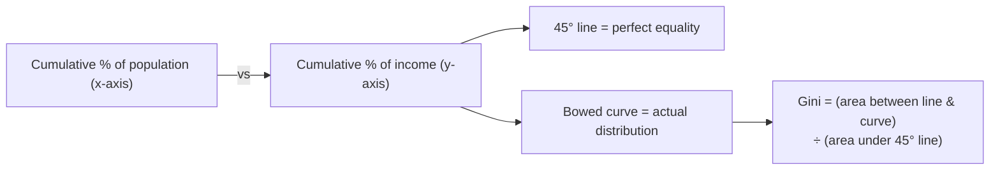
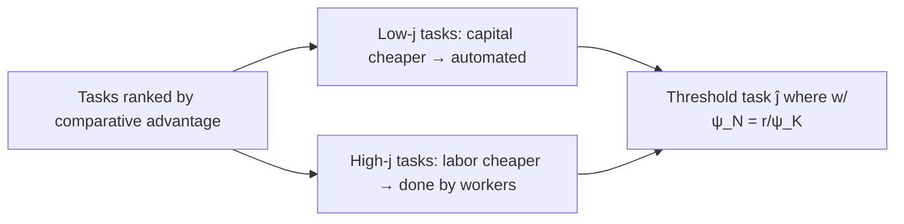

# Heterogeneity, Inequality & Polarization

> Part of: [[Macro-Economics]]
> **Lecture 09** — Macro-Economics, "Heterogeneity, Inequality, and Polarization in the Labor Market"
> Key concepts: [[Heterogeneity]], [[Inequality Measures]], [[Skill-Biased Technological Change]], [[Polarization]], [[Routine-Biased Technological Change]], [[Task-Based Model]], [[Automation]], [[Labor Share]]

---

## 🗺️ Where This Fits

The models so far ([[Lec_07-Labor Market]], [[Lec_08-Labor Market Data, Participation & Unemployment]]) assumed **homogeneous** workers and firms — one representative worker, one wage. That is fine for *aggregate* responses but says nothing about **distribution**: who wins, who loses, and why inequality has changed.

This lecture introduces **heterogeneity** and asks what simple, tractable modifications of the standard labor model can explain the major empirical trends in inequality. The story moves in three stages:

1. **Skill-biased technological change (SBTC)** — split workers into skilled/unskilled.
2. **Polarization** — the middle hollows out; shift the lens from *skill* to *tasks/occupations*.
3. **Task-based models of automation** — the modern framework, with displacement, productivity, and reinstatement effects.

> [!note] An explicit caveat from the slides
> SBTC and routinization are *not* the only explanations for inequality — they get attention because they are empirically important *and* require only simple extensions of the model we already have. This is a "scratch the tip of the iceberg" tour, focused on **income** (not wealth) inequality.

---

## 🤔 Why We Care About Heterogeneity

A representative-agent model cannot address:

- **Distributional consequences of policy** — the heart of [[Lec_10-Fiscal Policy]] analysis (and increasingly monetary policy too).
- **Differences in behavior across households** — e.g. heterogeneity in the **marginal propensity to consume (MPC)**, which determines how much a stimulus or recession is amplified (the "matching multiplier").
- **Sectoral trends** — shifts across industries, education groups, and occupations that aggregates hide.

---

## 📏 Measuring Inequality

Main data sources: the **World Inequality Database (WID)** and the **Global Repository of Income Dynamics (GRID)**.

| Measure | Definition | Note |
|---|---|---|
| ==**Gini coefficient**== | Area between Lorenz curve and 45° line; $0$ = perfect equality, $1$ = perfect inequality | Most common single-number summary |
| **Variance of log income** | $\operatorname{Var}(\ln y)$ | Decomposable into components |
| **Coefficient of variation** | $\sigma / \mu$ | Rarely used |
| **Percentile ratios** | 90/10, 90/50, 50/10 | Locate *where* in the distribution inequality lives |

> [!tip] Why the 90/50 and 50/10 split matters so much
> Breaking the 90/10 ratio into an **upper half (90/50)** and a **lower half (50/10)** is the single most important diagnostic in this lecture. The two halves moved *together* in the 1980s but *diverged* afterward — and that divergence is exactly what motivates the shift from "skill" to "polarization."

The **Lorenz curve** underlying the Gini:

---

## 🧠 Stage 1 — Skill-Biased Technological Change (SBTC)

### The Idea

Technology raises the productivity of **skilled** workers relative to **unskilled** workers, widening the wage gap. Empirically the **college wage premium** rose sharply: a coefficient of $0.68$ in a Mincer regression means $e^{0.68}\approx 1.97$ — a college graduate earns **~97% more**.

![[l9_college_premium.png|560]]
*The college/high-school wage premium over time (Acemoglu & Autor 2011). The rising gap is the classic SBTC fact.*

### A Simple Model

Take two types of labor — skilled $N_s$ and unskilled $N_u$ — that are **substitutes** in production. Modify the production function to a nested CES form:

$$Y = AK^\alpha N^{1-\alpha} = AK^\alpha\Big[\big((A_s N_s)^\sigma + (A_u N_u)^\sigma\big)^{1/\sigma}\Big]^{1-\alpha}$$

Under the parameter restriction $0 < 1-\alpha < \sigma < 1$:

- $N_s$ and $N_u$ are **substitutes**.
- A rise in **skilled productivity $A_s$** *increases* $\text{MPN}_s$ but *decreases* $\text{MPN}_u$.

### Two Segmented Markets

Treat skilled and unskilled labor as **two separate markets** (extreme assumption: each worker participates in only one). A positive $A_s$ shock shifts only the skilled labor-demand curve:

> [!success] Result of the SBTC model
> A positive skill-biased shock raises **both employment and wages of skilled** workers and lowers **both for unskilled** workers — generating wage inequality and differential employment from one simple parameter change. Consistent with the 1980s data.

> [!question] But is it really *only* about skill?
> Did the effect of skill **change over time**? The next section says yes — after ~1990 the simple skill story breaks down, which forces a richer framework.

---

## 🏗️ Stage 2 — Polarization

### The Empirical Turn

From the 1990s, the simple SBTC story fits less well:

- Inequality kept widening in the **upper half** (90/50 keeps rising)…
- …but **stopped** widening in the **lower half** (50/10 flat or shrinking).

![[l9_9050_5010.png|560]]
*90/50 and 50/10 log earnings ratios (Autor, Katz & Kearney 2006). The two halves track together through the 1980s, then diverge — the upper half keeps climbing while the lower half stalls.*

Simultaneously, **employment grew at the top *and* bottom** of the skill distribution but **shrank in the middle** — the hollowing-out called ==**polarization**==.

![[l9_emp_growth_by_skill.png|600]]
*Smoothed employment-share growth by occupational skill percentile (Autor, Katz & Kearney 2006). The 1980s line is roughly monotonic in skill; the 1990s line is U-shaped — the signature "polarization curve."*

> [!tip] What polarization forces us to do
> A monotonic "more skill = better" story (SBTC) **cannot** produce a U-shape. Polarization shifts the discussion from **education/skill** to **occupation/task**, and ties directly to **automation, robots, and AI**.

### The Occupational Bar Chart

![[l9_occupation_shares.png|560]]
*Percent change in employment shares by occupation group (Jaimovich & Siu). Middle-skill routine occupations shrink; non-routine cognitive (top) and non-routine manual (bottom) grow.*

---

## 🔧 Stage 3 — Routinization & the Task Framework

### Classifying Occupations

Occupations are split along **two dimensions** (Autor, Levy & Murnane 2003; Acemoglu & Autor 2011):

|  | **Routine** (follows explicit rules) | **Non-routine** (needs flexibility, creativity, interaction) |
|---|---|---|
| **Cognitive** | Routine Cognitive (RC): bookkeepers, bank tellers, clerks, data entry | Non-routine Cognitive (NRC): managers, analysts, programmers, economists |
| **Manual** | Routine Manual (RM): machine operators, assemblers, fabricators | Non-routine Manual (NRM): janitors, home-care aides, bartenders, hairstylists |

> [!info] The central hypothesis — "routinization"
> Computers (and capital generally) are **close substitutes** for *routine* tasks (which can be codified into rules) and **complements** to *non-routine* tasks. So technological progress **displaces the routine middle** (RC + RM) while **raising demand at both ends** (NRC at the top, NRM at the bottom) — producing polarization. Offshoring of routine work reinforces this.

The BLS Occupational Outlook data make it concrete: routine middle jobs (metal/plastic machine workers, office clerks, travel agents) are projected to **decline ~6%**, while non-routine jobs at both ends (home-health aides +21%, software developers +17%, economists higher pay) **grow**.

### A Simple Automation Model

Let routine hours $N_R$ and non-routine hours $N_{NR}$ enter production, with **computer capital $K_C$** a substitute for routine labor:

$$Y_t = (N_{R,t} + K_{C,t})^\alpha\, N_{NR,t}^{1-\alpha}, \qquad 0 < \alpha < 1$$

Labor demand = marginal products:

$$\text{MPN}_R = \alpha\,(N_R + K_C)^{\alpha-1} N_{NR}^{1-\alpha} = w_R$$
$$\text{MPN}_{NR} = (1-\alpha)(N_R + K_C)^{\alpha} N_{NR}^{-\alpha} = w_{NR}$$

The **differential effect** of more computer capital is the whole point:

$$\frac{\partial \text{MPN}_R}{\partial K_C} = (\alpha-1)\alpha\,(N_R+K_C)^{\alpha-2}N_{NR}^{1-\alpha} \;\boxed{< 0}$$
$$\frac{\partial \text{MPN}_{NR}}{\partial K_C} = (1-\alpha)\alpha\,(N_R+K_C)^{\alpha-1}N_{NR}^{-\alpha} \;\boxed{> 0}$$

> [!example] Falling computer prices, step by step
> 1. The price of computer capital $K_C$ falls → firms buy **more $K_C$**.
> 2. More $K_C$ **lowers** $\text{MPN}_R$ → routine labor demand falls → **$w_R$ down**.
> 3. More $K_C$ **raises** $\text{MPN}_{NR}$ → non-routine labor demand rises → **$w_{NR}$ up**.
> Result: wages diverge between routine and non-routine work — polarization. *(Supply also responds, so this is suggestive, not a full equilibrium solution.)* Empirically, the prices of **robots** and **ICT capital** have fallen dramatically, matching the model's trigger.

---

## 🧱 The Task-Based Model of Production

A more flexible alternative: total output is a **sum (or aggregate) of tasks**, and *each task* can be produced by **either capital or labor**.

For task $j$:
$$y(j) = \psi_N(j)\,N(j) + \psi_K(j)\,K(j)$$

where $\psi_N(j)$, $\psi_K(j)$ are labor and capital productivity in task $j$. With wage $w$ and capital rent $r$, the **unit cost** of task $j$ is $\tfrac{w}{\psi_N(j)}$ with labor and $\tfrac{r}{\psi_K(j)}$ with capital. The firm picks the cheaper:

$$\text{Use capital for task } j \iff \frac{w}{\psi_N(j)} > \frac{r}{\psi_K(j)}, \qquad \text{else use labor.}$$

### Three Effects of Better Capital

| Effect | What happens | Wage impact |
|---|---|---|
| **Productivity effect** | Capital gets cheaper/better at a task → cost of output falls; if the task allocation doesn't change, workers are **better off** (same wage, lower prices) | Wage ↑ (real) |
| **Displacement effect** | A task crosses the threshold and is **reallocated from labor to capital** | Wage ↓ |
| **Reinstatement effect** | **New tasks** are created, a subset performed by labor (occupations that didn't exist before) | Wage ↑ |

![[l9_task_factor_demand.png|560]]
*Effect of automation on factor demand (Steinsson textbook). Automation of a labor task shifts labor demand left ($w$↓) and capital demand right ($r$↑); displaced workers compete for remaining jobs, pushing wages down further before adjustment.*

> [!warning] The pie can grow while labor's slice shrinks
> Automation can raise **total output** (productivity effect) yet leave **labor worse off** if displacement outweighs productivity and reinstatement. Whether a given innovation helps or hurts workers depends on the *balance* of the three effects — the task model captures this richness that Cobb-Douglas/CES cannot.

### New Tasks & Long-Run Growth

Long-run growth involves continual **destruction and creation** of tasks — old tasks automated away, new tasks (reinstatement) created for labor. The historical shift of workers across **agriculture → manufacturing → services** is the macro footprint of this churn.

![[l9_tasks_schematic.png|560]]
*Schematic evolution of tasks and labor (Acemoglu & Restrepo 2019): automation displaces labor from old tasks while new tasks reinstate it.*

---

## 📉 Connection to the Declining Labor Share

The ==**labor share**== is the fraction of total income paid as wages. It has **declined** in recent decades (Israel, OECD). Acemoglu & Restrepo (2019) decompose the effect of automation on labor demand into:

$$\Delta(\text{labor demand}) = \underbrace{\text{Productivity effect}}_{+} \;-\; \underbrace{\text{Displacement effect}}_{-} \;+\; \underbrace{\text{Reinstatement effect}}_{+}$$

Plus an aggregate **composition effect** — economic activity shifting across industries. The empirical decompositions (US 1947–1987 vs. 1987–2017) show **reinstatement weakening** and **displacement strengthening** in the later period — a plausible driver of the falling labor share.

---

## 🏛️ Polarization & Policy

The trends are politically charged, so economists use models to weigh policy **costs and benefits**. To evaluate policy we need to know what happens to displaced routine (R) workers — do they end up working, in R again, in low-skill service (NRM), in high-skill (NRC), or out of the labor force (NLF)?

The data (Jaimovich, Saporta-Eksten, Siu & Yedid-Levi 2021) show, for low-skilled US workers: a **~16 percentage-point drop in routine employment**, split roughly **2/3 into Not-in-Labor-Force and 1/3 into non-routine manual** service jobs. Same pattern for men, women, and low-cognitive-ability groups.

Two policy families:

- **Retraining** — move displaced workers into growing occupations.
- **Redistribution** — transfer to the losers.

> [!success] Policy findings
> A few policies are **aggregate welfare-improving, but none is Pareto-improving** — there are always losers. **Details matter enormously**: who gets treated and how programs are financed change the verdict. Models are essential precisely because the trade-offs are not obvious.

---

## 🎯 Summary

1. Representative-agent models can't address **distribution**; we add **heterogeneity** to study inequality and the differential effects of policy (including MPC heterogeneity).
2. Inequality measures: **Gini, variance of log, percentile ratios**. The **90/50 vs. 50/10** split is the key diagnostic.
3. **SBTC**: skilled and unskilled are substitutes; rising $A_s$ raises $w_s$/$N_s$ and lowers $w_u$/$N_u$. Fits the 1980s and the rising college premium.
4. After ~1990, **polarization**: upper-half inequality keeps rising while the lower half stalls; employment grows at top and bottom, shrinks in the **routine middle** — a U-shape SBTC can't explain.
5. **Routinization**: computers substitute for **routine** tasks and complement **non-routine** ones, displacing the middle. Shifts the lens from skill to **tasks/occupations**.
6. Simple automation model: more computer capital $K_C$ **lowers** $\text{MPN}_R$ and **raises** $\text{MPN}_{NR}$ → wage divergence.
7. **Task-based model**: each task done by cheaper of capital/labor; automation has **productivity (+), displacement (−), and reinstatement (+)** effects — output can grow while labor's share falls.
8. Explains the **declining labor share**; policy can raise aggregate welfare but **never Pareto-improves** — there are always losers, and design details matter.

---

## 📎 Related Notes

- Built on: [[Lec_07-Labor Market]] — the homogeneous labor model being relaxed; $\text{MPN}=w$
- Built on: [[Lec_08-Labor Market Data, Participation & Unemployment]] — measurement, NLF margin (where displaced workers go)
- Built on: [[Lec_04-Production]] — production function, CES, Cobb-Douglas; the basis for SBTC and task models
- Companion: [[Lec_10-Fiscal Policy]] — distributional analysis where heterogeneity is essential
- Concept: [[Skill-Biased Technological Change]], [[Routine-Biased Technological Change]], [[Task-Based Model]], [[Labor Share]], [[Automation]]
