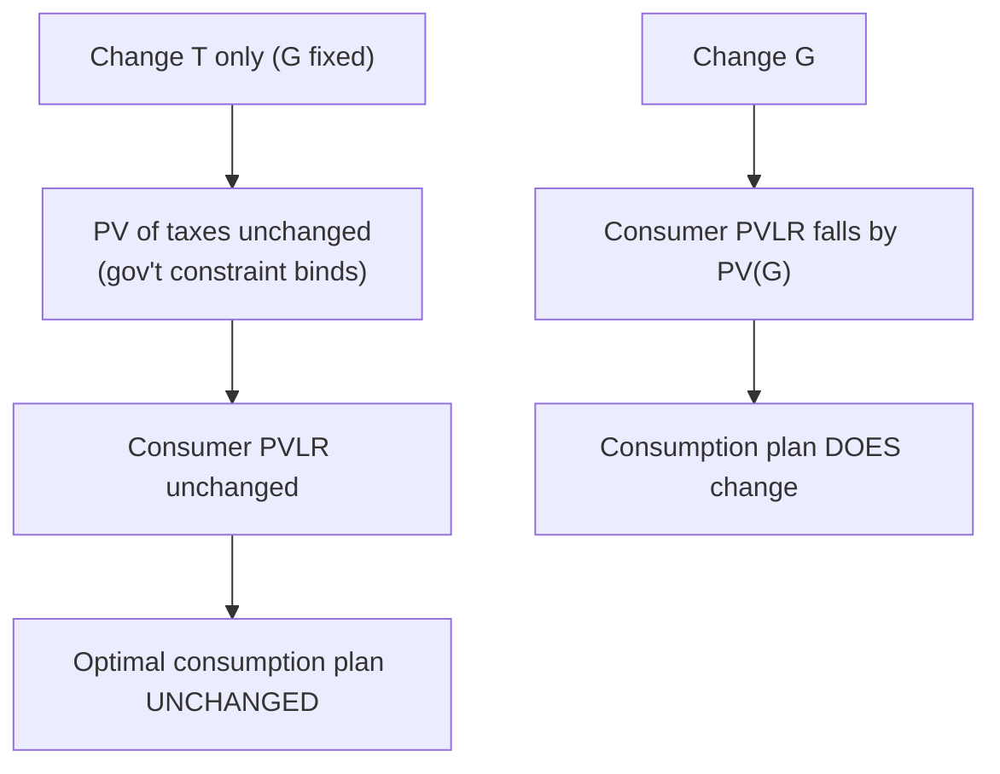
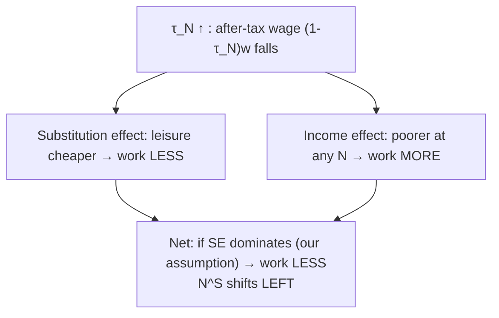
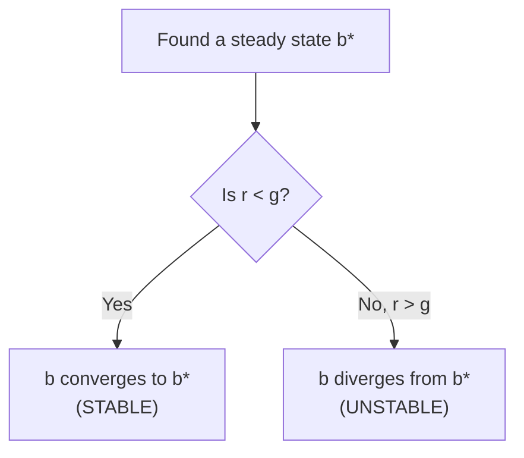

# Fiscal Policy — Government Expenditure & Taxes

> Part of: [[Macro-Economics]]
> **Lecture 10** — Macro-Economics, "Fiscal Policy: Government Expenditure and Taxes"
> Key concepts: [[Government Budget Constraint]], [[Ricardian Equivalence]], [[Lump Sum Tax]], [[Labor Income Tax]], [[Consumption Tax]], [[Crowding Out]], [[Public Debt Dynamics]], [[Primary Deficit]]

---

## 🗺️ Where This Fits

We now put the **government** into the models already built: the two-period consumption model ([[Lec_02-Consumption and Saving]]), the goods market ([[Lec_06-Equilibrium in the Goods Market]]), and the labor market ([[Lec_07-Labor Market]]). The questions: how do **government spending $G$** and **taxes $T$** affect consumption, the interest rate, employment, and output — and when does the *financing method* (taxes vs. debt) matter?

> [!warning] Three modelling caveats stated upfront
> 1. The model takes a deliberately **negative view of government spending** — this is an *assumption*, not a law. $G$ here is a pure resource drain (no productive public goods).
> 2. The model is **real** — there is **no inflation**, which would change some results.
> 3. Other fiscal tools (unemployment insurance, transfers beyond lump sums) are **not** covered.

---

## 📚 Definitions

| Term | Reality | In the model |
|---|---|---|
| **Government expenditure** | Defense, education, health, municipal, development, debt repayment | Goods-market purchases $G_t$ + debt repayment $(1+r)B_{t-1}$ |
| **Government revenue** | Labor/capital/corporate income tax, VAT, plus bond issuance | Lump-sum taxes $T_t$ (later: $\tau_N$, $\tau_C$) + new debt $B_t$ |
| ==**Budget deficit**== | Expenditure − revenue in a period | Primary deficit $D_t = G_t - T_t$ |
| ==**Government debt**== | Stock of debt owed to domestic & foreign households | Stock $B_t$ (domestic only) |

---

## 🏛️ The Government Budget Constraint

In each period, **uses = resources**:

$$\underbrace{G_t + (1+r)B_{t-1}}_{\text{uses: spending + debt service}} = \underbrace{T_t + B_t}_{\text{resources: taxes + new borrowing}}$$

### Collapsing to a Lifetime Constraint

For two periods (0 and 1), assume **no initial debt** ($B_{-1}=0$) and **no debt left at the end** ($B_1=0$). Substituting period 1 into period 0:

$$\boxed{G_0 + \frac{G_1}{1+r} = T_0 + \frac{T_1}{1+r}}$$

> [!info] The single most important fiscal identity
> The **present value of lifetime government spending equals the present value of lifetime tax revenue.** Debt is only a device for **moving taxes through time** — it is *not* an extra source of resources. Every dollar of $G$ is ultimately paid for by some household's taxes, now or later.

---

## 🛒 Fiscal Policy in the Consumption Model

The two-period consumer with disposable income $y^d_t = y_t - T_t$:

$$c_0 + \frac{c_1}{1+r} = y^d_0 + \frac{y^d_1}{1+r} = y_0 + \frac{y_1}{1+r} - \left[T_0 + \frac{T_1}{1+r}\right]$$

Substitute the government's lifetime constraint ($\text{PV taxes} = \text{PV spending}$):

$$\boxed{c_0 + \frac{c_1}{1+r} = y_0 + \frac{y_1}{1+r} - \left[G_0 + \frac{G_1}{1+r}\right]}$$

> [!success] The key substitution
> In the consumer's lifetime budget, **taxes drop out and are replaced by spending $G$**. Only the **present value of $G$** lowers the consumer's lifetime resources (PVLR). Bonds and the *timing* of taxes never appear.

---

## ⚖️ Ricardian Equivalence

This identity delivers ==**Ricardian Equivalence (RE)**==:

> [!info] Ricardian Equivalence — two statements
> 1. Financing a given $G$ with **taxes** is equivalent to financing it with **debt** (same effect on consumers).
> 2. A change in $T$ **not** accompanied by a change in $G$ does **not** affect PVLR or consumption.
> **Intuition:** a tax cut today with unchanged $G$ means the government borrows; rational consumers know they will repay it via higher future taxes, so they **save the entire tax cut** to meet that future liability.

### When RE Fails (Realistically, It Does)

> [!warning] Reasons RE breaks down
> - **Different planning horizons** for government vs. consumers (finite lives, no bequest motive).
> - **Heterogeneity** in horizons (young vs. old).
> - **Credit-market imperfections**: government borrows cheaper than households; **borrowing-constrained** consumers can't smooth.
> - **Uncertainty** and information frictions.
> - **Distortionary (non-lump-sum) taxes** and elastic labor supply.
> - **Inflation** (the model assumes none).

---

## 📊 Goods-Market Effects

### Example 1 — Lower $G$ *and* Lower $T$ (balanced)

Government cuts $G$ and cuts taxes by the same amount.

- For consumers this is a **positive income shock** (PVLR rises because PV(G) falls) → they **consume more and save more**, but smooth, so $|\Delta c| < |\Delta T|$.
- The **saving curve shifts right** → lower $r$, more investment $I$.
- **GDP is unchanged** (no change in $A,K,N$): the rise in $C+I$ exactly offsets the fall in $G$.

This is the **mirror image of crowding out** (see [[Lec_06-Equilibrium in the Goods Market]]).

### Example 2 — Same $G$, Lower $T$, RE Fails

- If **RE holds**: no response at all.
- If **RE fails**: consumers treat the tax cut as a positive income shock → $C$↑, private $S$↑, but **government saves less** (borrows more).
- Net national saving $S = Y - C - G$ **falls** (since $C$↑, $G$ and $Y$ unchanged) → **S curve shifts left** → **$r$↑, $I$↓**. This *is* crowding out via deficit-financed tax cuts.

---

## 🧾 Empirical Evidence on the Timing of Taxes

### Shapiro & Slemrod (1995) — the 1992 withholding change

In Jan 1992, President Bush reduced tax **withholding** (not tax **rates**) — a pure *timing* shift (~$29/worker/month, ~$25bn total), deferring payment ~1 year with **no change in total obligation**. Pure Ricardian logic says: **save it all**.

![[l10_shapiro_slemrod_table.png|560]]
*Survey responses by income group (Shapiro & Slemrod 1995). ~43% of households planned to **spend** the extra take-home pay (s.e. ≈ 3pp).*

> [!example] What the 43% rules out
> The estimate that **~43% planned to spend** is strong evidence **against both** extremes: it is far from **0%** (the pure life-cycle / Ricardian prediction) *and* far from **~100%** (the naive Keynesian consumption function). Reality sits in between — and no clean relationship with liquidity constraints (income, financial condition) emerges. Consumers behave neither fully rationally-forward-looking nor mechanically Keynesian.

### Stimulus Payments (transfers, not timing shifts)

Governments use direct transfers in crises (2008 financial crisis; Covid-19). Key questions: **what is the implied MPC?** and **is this the most efficient stimulus?**

- **Shapiro & Slemrod (2009)** — 2008 US rebates ($300–600/person, ~130m households, >$100bn). Survey of intended use; notably **no difference** between those who had already received vs. not.
- **Feldman & Heffetz (2022)** — Israel mid-2020 grant (NIS 750/adult, less per child, ~NIS 6.5bn ≈ 0.5% of GDP). Substantial **donate/help** categories; results broadly in line with US data.

> [!tip] The policy trade-off
> Stimulus transfers are **easy to implement but expensive and untargeted**. ~40% of Israeli respondents said they were *not hurt* by Covid — so broad transfers partly pay people who don't need to spend. Open questions: can we **target** likely spenders? what is the opportunity cost of the budget? does **timing** (early vs. late crisis) matter? is Covid special (people *couldn't* spend)?

---

## 👷 Fiscal Policy in the Labor Market Model

Add three taxes to the household budget constraint — lump-sum $T$, labor-income tax $\tau_N$, consumption tax $\tau_C$:

$$\max_{C,N} U(C,N) \quad \text{s.t.} \quad (1+\tau_C)\,C = (1-\tau_N)\,wN + B - T$$

### Solving (Lagrangian)

$$\mathcal{L} = U(C,N) + \lambda\big[(1-\tau_N)wN + B - T - (1+\tau_C)C\big]$$

$$U_C = \lambda(1+\tau_C), \qquad U_N = -\lambda(1-\tau_N)w$$

Divide the second by the first:

$$\boxed{-U_N = w\,\frac{1-\tau_N}{1+\tau_C}\,U_C}$$

This is the **static FOC with taxes**. The marginal benefit of working is the wage **net of income tax**, converted into consumption **net of consumption tax**. Both $\tau_N$ and $\tau_C$ work the same way — they shrink the effective return to labor.

### Lump-Sum Tax → Pure Income Effect

$T$ enters exactly like a (negative) wealth term $B$:

| Change | Effect on worker | Labor supply |
|---|---|---|
| $T$ ↑ (more taxes / lower transfers) | Income falls → work more | $N^S$ shifts **right** |
| $T$ ↓ (lower taxes / more transfers) | Income rises → work less | $N^S$ shifts **left** |

### Distortionary Tax ($\tau_N$ or $\tau_C$) → Income *and* Substitution Effects

A labor-income tax rotates the budget line in (Leisure, $C$) space: the slope flattens from $-w$ to $-(1-\tau_N)w$.

> [!info] Consistency with the upward-sloping supply curve
> In [[Lec_07-Labor Market]] we assumed the **substitution effect dominates** so that $N^S$ slopes up. The *same* assumption implies a higher labor-income tax **lowers** labor supply (shifts $N^S$ left). A distortionary tax therefore **does** shift the supply curve, unlike a lump-sum tax which moves it via the income effect only. Permanent tax changes also hit **PVLR** substantially.

### Worked Example — $G$↑ financed by lump-sum $T$↑ (short run)

| Question | Answer |
|---|---|
| Does $N^D$ shift? | **No** — $A, K$ unchanged |
| Does $N^S$ shift? | **Yes** — negative income effect → $N^S$ shifts **right** |
| New labor-market eqm | **More $N$, lower $w$** |
| New goods-market eqm | Consumers smooth, $|\Delta c|<|\Delta T|$ → $S$ shifts **left** → lower $S,I$, higher $r$ |
| Output, $I$, $C$, $r$ | $Y$ **↑**, but $I$, $S$, $C$ **↓**, $r$ **↑**. Note $\Delta Y < \Delta G$ |

![[l10_labor_goods_equilibrium.png|600]]
*Two-panel equilibrium for a $G$↑/$T$↑ shock (lecture slide). Left: labor market — $N^S$ shifts right, $N$↑, $w$↓. Right: goods market — $S$ shifts left, $r$↑, $I$↓.*

### Worked Example — Permanent $\tau_C$↑ with PVLR held fixed (long run)

Proceeds rebated so **PVLR is unchanged** → neutralizes the income effect, leaving only **substitution/distortion**.

- **Short run**: $N^D$ no shift; $N^S$ shifts **left** (distortion) → **lower $N$, higher $w$**.
- **Long run**: lower expected future labor → firms cut optimal future capital $K^f$ → **lower investment today** → $N^D$ shifts **left** (less $K$) → **lower $N$ and lower $w$** relative to the short run (ambiguous vs. the initial state).

> [!tip] Why distortionary taxes are costlier than lump-sum
> Lump-sum taxes are *non-distortionary* — they only move the income effect. Distortionary taxes ($\tau_N$, $\tau_C$) drive a **wedge** between the worker's and firm's valuation of labor, shrinking employment even before any income effect, and depressing long-run capital. This is the efficiency cost ("deadweight loss") of realistic taxation.

---

## 💳 Dynamics of Public Debt

Debt and deficits dominate policy debate because the government must keep debt at **sustainable** levels to keep borrowing at reasonable rates (else default risk). Debt is tracked as a **ratio to GDP**, so strong GDP growth makes more debt sustainable.

> [!note] Illustrative assumptions
> Growth rate $g$ and interest rate $r$ are **exogenous and constant**; **no inflation**.

### Deriving the Law of Motion

Start from the budget constraint with primary deficit $D_t = G_t - T_t$:

$$D_t + (1+r)B_{t-1} = B_t$$

Use lower-case for GDP ratios ($b_t = B_t/Y_t$, $d_t = D_t/Y_t$) and constant growth $Y_t = (1+g)Y_{t-1}$ (so $Y_{t-1}/Y_t = 1/(1+g)$). Dividing through:

$$b_t = d_t + \frac{1+r}{1+g}\,b_{t-1}$$

Subtracting $b_{t-1}$ gives the **change** in the debt ratio:

$$\boxed{\Delta b_t = d_t + \frac{r-g}{1+g}\,b_{t-1}}$$

> [!success] The two forces on the debt ratio
> The debt-to-GDP ratio rises with (1) the **primary deficit** $d_t$ and (2) the **interest-growth differential** $r - g$. If $r > g$, debt service outpaces growth and the existing stock $b_{t-1}$ keeps pushing the ratio up — even with a balanced primary budget. If $g > r$, growth erodes the ratio.

### Calculating the Path

$$b_t = d_t + \frac{1+r}{1+g}b_{t-1}$$

> [!example] One-period projection
> With $r=2\%$, $g=1.5\%$, primary deficit $d=1\%$, current $b=70\%$:
> $$b_t = 0.01 + \frac{1.02}{1.015}\times 0.7 \approx 0.713 = 71.3\%$$

### Steady-State (Constant) Debt Ratio

Set $\Delta b = 0$:

$$0 = d + \frac{r-g}{1+g}b \implies \boxed{b^* = d\,\frac{1+g}{g-r}}$$

> [!example] Steady-state debt ratio
> With $d=0.01$, $g=0.025$, $r=0.02$: $\; b^* = 0.01\times\frac{1.025}{0.005} = 2.05 = 205\%$.
> If $r>g$ the steady-state $b^*$ can be **negative** (sustainable only as net assets).

### Stability

> [!warning] The stability condition is $r < g$
> - $g > r$ (growth beats interest): any deviation in $b$ **converges back** to steady state — debt is self-correcting.
> - $r > g$ (interest beats growth): deviations **diverge** — debt dynamics are explosive, and a high-debt country can spiral. This is the crux of every debt-sustainability debate.

### Solving for Required Growth

Rearranging $\Delta b = 0$ for $g$:

$$g = \frac{r\,b + d}{b - d}$$

> [!example] Required growth to stabilize debt
> With $b=0.6$, $r=0.02$, $d=0.03$: $\; g = \frac{0.02\times0.6 + 0.03}{0.6-0.03} \approx 0.074 = 7.4\%$ — a very high growth rate needed to sustain that deficit.

---

## 🎯 Summary

1. **Government budget constraint**: $G_t + (1+r)B_{t-1} = T_t + B_t$; in PV terms, **PV(spending) = PV(taxes)**. Debt only moves taxes through time.
2. In the consumer's lifetime budget, **taxes are replaced by $G$** — only PV($G$) lowers PVLR.
3. **Ricardian Equivalence**: changing **$T$ alone** (with $G$ fixed) doesn't affect consumption; tax vs. debt financing are equivalent. **Fails** in reality (finite horizons, credit constraints, distortionary taxes, uncertainty, inflation).
4. **Goods market**: balanced $G$↓/$T$↓ → $C$↑, $I$↑, $r$↓, $Y$ unchanged (reverse crowding out). Deficit-financed $T$↓ with RE-failure → $C$↑, national $S$↓, $r$↑, $I$↓.
5. **Evidence**: ~43% spend a tax-timing windfall (Shapiro–Slemrod) — between Ricardian (0%) and Keynesian (~100%). Stimulus transfers are easy but untargeted.
6. **Labor market with taxes**: static FOC becomes $-U_N = w\frac{1-\tau_N}{1+\tau_C}U_C$. Lump-sum $T$ = pure income effect ($N^S$ right when $T$↑); distortionary $\tau_N,\tau_C$ add a substitution effect → $N^S$ shifts **left**, with long-run capital decline.
7. **Debt dynamics**: $\Delta b_t = d_t + \frac{r-g}{1+g}b_{t-1}$. Steady state $b^* = d\frac{1+g}{g-r}$. **Stable iff $r<g$**; if $r>g$ debt diverges.

---

## 📎 Related Notes

- Built on: [[Lec_02-Consumption and Saving]] — two-period model, Euler equation, PVLR (the engine of Ricardian Equivalence)
- Built on: [[Lec_06-Equilibrium in the Goods Market]] — $S=I$, real interest rate, **crowding out** (this lecture is the mirror image)
- Built on: [[Lec_07-Labor Market]] — static FOC, income vs. substitution effects (extended here with taxes)
- Companion: [[Lec_09-Inequality & Polarization]] — distributional analysis where heterogeneity makes fiscal policy bite differently
- Concept: [[Ricardian Equivalence]], [[Government Budget Constraint]], [[Public Debt Dynamics]], [[Lump Sum Tax]], [[Labor Income Tax]]
