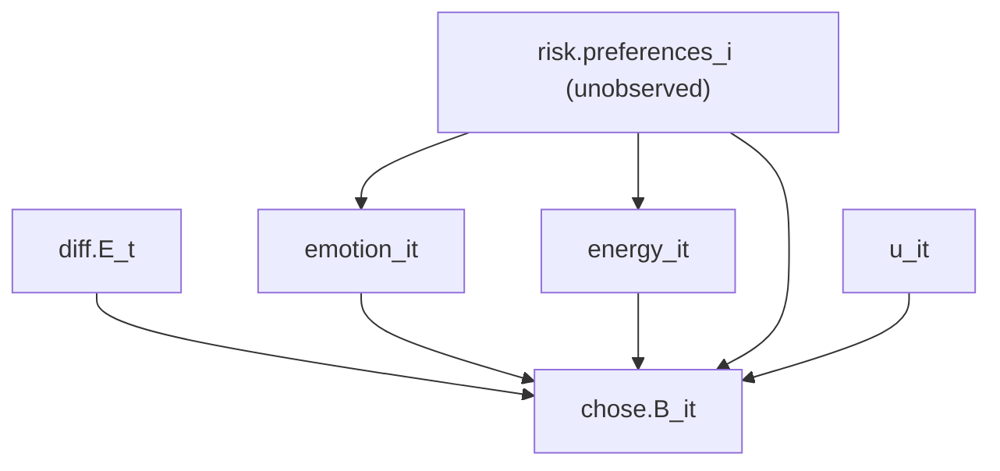

# Practice Exam — Emotions & Risky Choice (Lab-in-Field)

> Part of: [[Econometrics]]
> **Practice Exam** — Applied Econometrics, Dr. Aluma Dembo
> Key concepts: [[_Econometrics Concepts#F-test|F-test]], [[_Econometrics Concepts#Linear Probability Model|Linear Probability Model]], [[_Econometrics Concepts#Causal Diagram|Causal Diagram]], [[_Econometrics Concepts#Endogeneity|Endogeneity]], [[_Econometrics Concepts#Omitted Variable Bias|Omitted Variable Bias]], [[_Econometrics Concepts#Fixed Effects|Fixed Effects]], [[_Econometrics Concepts#Within Estimator|Within Estimator]], [[_Econometrics Concepts#Probit Model|Probit Model]], [[_Econometrics Concepts#Marginal Effects|Marginal Effects]], [[_Econometrics Concepts#Difference-in-Differences|Difference-in-Differences]], [[_Econometrics Concepts#Instrumental Variables|Instrumental Variables]], [[_Econometrics Concepts#Instrument Relevance|Instrument Relevance]], [[_Econometrics Concepts#Instrument Validity|Instrument Validity]]
> Builds on: [[Lec_02-Linear Probability Model (LPM)]], [[Lec_03-Logit & Probit Models]], [[Lec_04-Instrumental Variables]], [[Lec_08-Fixed Effects in Panel Data]]

---

## 📋 The Setup (read this first)

A researcher studies **the effect of emotion and energy on risky choice**. 243 subjects play 15 rounds of a lottery game on an app; before each round they self-report **emotion** (1 = sad … 7 = happy) and **energy** (1 = tired … 7 = energetic).

| Variable                          | Meaning                                                                           |
| --------------------------------- | --------------------------------------------------------------------------------- |
| `chose.B`$_{it}$                  | **=1 if subject $i$ chose the risky Lottery B** in round $t$ (the binary outcome) |
| `diff.E`$_t$                      | Expected payout of B − Expected payout of A in round $t$ (varies by round only)   |
| `emotion`$_{it}$, `energy`$_{it}$ | Self-reported emtotion / energy, 1–7                                              |
| `dayofweek`, `timeofday`          | When the choice was made (rounds were randomised across the week)                 |
| `celsius`$_{it}$, `sleep`$_{it}$  | Outdoor temperature & hours slept the night before                                |

> [!tip] The single most important observation
> The outcome `chose.B` is **binary**. So **every `lm`/`feols`/`anova` in this exam is a [[_Econometrics Concepts#Linear Probability Model|Linear Probability Model]]** — coefficients are changes in the *probability* of choosing B, measured in **percentage points**. Spotting this immediately tells you how to interpret every coefficient and why robust/clustered SEs appear. See [[Lec_02-Linear Probability Model (LPM)]].

This is a **panel**: each subject $i$ is observed over $t = 1..15$ rounds → opens the door to [[_Econometrics Concepts#Fixed Effects|Fixed Effects]].

---

## Q1 — Joint test, DAG, and endogeneity [20 pts]

### 1a — The `anova()` test

Two **nested** models (OLS2 is OLS1 with $\beta_2=\beta_3=0$):

$$\text{OLS1:}\quad \textit{chose.B}_{it} = \beta_0 + \beta_1\textit{diff.E}_t + \beta_2\textit{emotion}_{it} + \beta_3\textit{energy}_{it} + u_{it}$$
$$\text{OLS2:}\quad \textit{chose.B}_{it} = \beta_0 + \beta_1\textit{diff.E}_t + u_{it}$$

`anova(ols1, ols2)` runs an [[_Econometrics Concepts#F-test|F-test]] of $H_0:\beta_2=\beta_3=0$ against $H_1:$ at least one $\neq 0$. From the output: $F = 147.68$ on $2$ and $3641$ df, $p < 2.2\times10^{-16}$.

> [!success] Answer
> **Reject $H_0$.** Because $p < 0.05$ (indeed astronomically small), at least one of `emotion`, `energy` has a non-zero effect on `chose.B`.
>
> **What it tells us about OLS2:** since emotion and/or energy genuinely belong in the model but are *left out* of OLS2, they get absorbed into **OLS2's error term**. OLS2 is therefore an under-specified model whose error contains a systematic (non-random) component.

> [!example] Where the F-stat comes from
> The restricted model OLS2 has a larger residual sum of squares (RSS$_2 = 734.45$) than the unrestricted OLS1 (RSS$_1 = 679.34$). The test asks whether dropping the two regressors costs "too much" fit:
> $$F = \frac{(\text{RSS}_2 - \text{RSS}_1)/q}{\text{RSS}_1/(n-k-1)} = \frac{55.108/2}{679.34/3641} \approx 147.7$$
> with $q=2$ restrictions. Large $F$ ⇒ the variables matter ⇒ reject. (See [[_Econometrics Concepts#Hypothesis Testing|Hypothesis Testing]].)

### 1b — Updated causal diagram

The colleague's worry: **intrinsic risk preferences** are an individual, time-invariant trait that makes people *both* more optimistic/energetic *and* more likely to pick the risky lottery. That makes `risk.preferences`$_i$ a **common cause (confounder)** of emotion, energy and the choice.



The new node `risk.preferences`$_i$ has arrows into **emotion, energy, and chose.B** — it is the backdoor path that contaminates the emotion→choice and energy→choice relationships. See [[_Econometrics Concepts#Causal Diagram|Causal Diagram]], [[_Econometrics Concepts#Endogeneity|Endogeneity]].

> [!tip] Hand-drawable version (exam practice)
> The Mermaid diagram above renders for reading, but in an exam you'd **draw** this. Here's the same DAG as an editable Excalidraw canvas — open it, redraw it freehand a few times until the confounder structure is muscle memory. Red arrows = the backdoor path you must be able to spot and explain.
>
> 
### 1c — Where do risk preferences show up in OLS1, and what does it mean for $\beta_2,\beta_3$?

OLS1 does **not** include a `risk.preferences` regressor (it's unobserved), so it sits inside the **error term $u_{it}$**. But risk preferences also drive emotion and energy → so the regressors are correlated with the error:

$$\text{Cov}(\textit{emotion}_{it}, u_{it}) \neq 0, \qquad \text{Cov}(\textit{energy}_{it}, u_{it}) \neq 0$$

> [!warning] Consequence
> This is textbook **[[_Econometrics Concepts#Endogeneity|Endogeneity]]** caused by an omitted common cause — i.e. **[[_Econometrics Concepts#Omitted Variable Bias|Omitted Variable Bias]]**. $\hat\beta_2$ and $\hat\beta_3$ are therefore **biased and do not measure the causal effect** of emotion/energy on choice; they partly pick up the effect of the omitted risk preferences. The estimates conflate "happier people choose B" with "risk-lovers are both happier *and* choose B."

---

## Q2 — Fixed effects & probit [20 pts]

R fits an individual fixed-effects LPM (`fe1`) with SEs clustered by subject `ID`:

```r
fe1 = feols(chose.B ~ diff.E + energy + emotion | ID, mydata)   # 243 individual FEs
```

| Term | Estimate | Std. Error (clustered) | $t$ | $p$ |
|------|---------:|-----------------------:|----:|----:|
| `diff.E`  | 0.0267 | 0.00089 | 30.05 | <2e-16 |
| `energy`  | 0.0297 | 0.00965 | 3.08 | 0.00233 |
| `emotion` | 0.0384 | 0.00720 | 5.33 | 2.27e-07 |

### 2a — Why FE1 over OLS1?

Intrinsic risk preferences are **time-invariant** (they don't change over the 5-day study). An [[_Econometrics Concepts#Individual Fixed Effect|Individual Fixed Effect]] $a_i$ is exactly a per-subject intercept that **absorbs every characteristic of $i$ that is constant over time** — including their unobserved risk preferences.

> [!success] Answer
> By including individual fixed effects, FE1 **demeans** each subject's data ([[_Econometrics Concepts#Within Estimator|Within Estimator]] / [[_Econometrics Concepts#Demeaning|Demeaning]]) and identifies $\beta_2,\beta_3$ purely from **[[_Econometrics Concepts#Within Variation|Within Variation]]** — how a person's *own* emotion/energy fluctuates round to round. Because risk preferences are fixed within a person, they are differenced out, so the confounder from Q1 is **controlled** and the endogeneity it caused is removed. Clustering SEs by `ID` accounts for the repeated observations per subject. See [[Lec_08-Fixed Effects in Panel Data]].

> [!example] Why the fixed effect *mechanically* absorbs risk preferences
> Write the model with a per-subject intercept $a_i$ (this is what `| ID` adds — one intercept per subject):
> $$\textit{chose.B}_{it} = a_i + \beta_1\textit{diff.E}_t + \beta_2\textit{emotion}_{it} + \beta_3\textit{energy}_{it} + u_{it}$$
> The estimator subtracts **each subject's own average** from every variable (the within / demeaning transform). For any quantity that is **constant within a subject** — like `risk.preferences`$_i$ — its value equals its own mean, so it subtracts to **zero**:
> $$\textit{risk.pref}_i - \overline{\textit{risk.pref}}_i = 0$$
> That's the whole trick: the confounder doesn't need to be measured — anything time-invariant for a subject is annihilated by demeaning and can no longer sit in the error correlating with emotion/energy.
>
> **Why `ID` (the subject) and not, say, `dayofweek`?** Put the fixed effect at the level where the confounder is *constant*. Risk preference varies **between people** but is **fixed within a person** across the 15 rounds — so subject-level (`ID`) effects kill it. Day or round effects wouldn't: risk preference isn't constant within a day. **Rule: FE at the level of the omitted variable you're trying to remove.**

![[PP01_fixed_effects.png|680]]

**Reading the figure.** *Left:* each subject is one colour; their points cluster because each has a different baseline (their fixed effect $a_i$). Risk-lovers sit high on *both* axes, so the **pooled OLS line (dashed, slope ≈ 0.12)** is steep — it's mostly measuring the between-person confound, not causation. *Right:* after subtracting each subject's own mean, every cloud recentres on $(0,0)$ — the $a_i$ differences vanish — and the remaining **within slope (≈ 0.04)** is the true effect of a person's emotion *changing*. That within slope is what FE1 reports, and it matches the exam's emotion coefficient (0.038).

### 2b — Interpreting the FE coefficients (with significance at α = 5%)

Still an LPM, so coefficients are in **percentage points**, now interpreted *relative to the subject's own average*:

- **`emotion` = 0.0384**: a one-point rise in emotion (above the subject's own mean) raises the probability of choosing B by **≈ 3.84 pp**. Significant: $p = 2.27\times10^{-7} < 0.05$ ✓ (also $|t|=5.33 > 1.96$).
- **`energy` = 0.0297**: a one-point rise in energy raises $P(\text{choose B})$ by **≈ 2.97 pp**. Significant: $p = 0.00233 < 0.05$ ✓ ($|t|=3.08 > 1.96$).

> [!success] Answer
> **Both coefficients are positive and statistically significant at the 5% level.** Within-person, happier and more energetic moments are associated with more risk-taking, by roughly 3.8 pp and 3.0 pp per scale point respectively.

### 2c — The probit model

```r
probit = glm(chose.B ~ diff.E + emotion + energy, mydata, family = binomial(link = "probit"))
```

| Term | Estimate | $z$ | $p$ |
|------|---------:|----:|----:|
| `(Intercept)` | −1.722 | −18.59 | <2e-16 |
| `diff.E`  | 0.0786 | 26.39 | <2e-16 |
| `emotion` | 0.229 | 10.63 | <2e-16 |
| `energy`  | 0.215 | 8.89 | <2e-16 |

> [!success] Answer
> $\hat\beta_2>0$ and $\hat\beta_3>0$, both highly significant → **higher emotion and higher energy each increase the probability of choosing B** (we can read the *sign* and *significance*).
>
> **But we cannot read the magnitude directly.** In a [[_Econometrics Concepts#Probit Model|Probit Model]] the coefficients are **not** the [[_Econometrics Concepts#Marginal Effects|Marginal Effects]]: the effect on the probability is $\beta_j\,\phi(\mathbf{x}'\boldsymbol\beta)$, which depends on where you evaluate it. So unlike the LPM, "0.229" is *not* "22.9 pp." To get a marginal effect you must compute $\phi(\cdot)$ at a chosen point (e.g. the mean). See [[Lec_03-Logit & Probit Models]].

![[PP01_probit_vs_lpm.png|620]]

The probit S-curve is **steepest in the middle and flat at the tails**: the same one-point rise in emotion moves the probability a lot near $P=0.5$ but barely at all near 0 or 1. That changing slope is the marginal effect $\phi(\cdot)\beta$. The grey LPM line has one constant slope — which is exactly why an LPM coefficient *is* its marginal effect while a probit coefficient is not.

> [!tip] Exam contrast to remember
> **LPM coefficient = the marginal effect (constant, in pp).** **Probit/logit coefficient = direction & significance only; marginal effect is non-constant.** This single distinction is worth easy marks.

---

## Q3 — Difference-in-Differences [30 pts]

> Builds on: [[Lec_10-Difference-in-Differences]] — this question is the lecture's 2×2 design applied to the exam shock. Same logic as the [[Lec_10-Difference-in-Differences#💡 Worked example — Card & Krueger (1994), minimum wage|Card & Krueger]] worked example.

86 of the 243 subjects sat an econometrics final on **Wednesday morning**, just before that day's task. On Wednesday, exam-takers reported mean emotion **2.53** vs **3.11** for non-takers — the exam was an emotional shock. We use it as a natural experiment via [[_Econometrics Concepts#Difference-in-Differences|Difference-in-Differences]] to recover the [[_Econometrics Concepts#Average Treatment Effect on the Treated|Average Treatment Effect on the Treated]] (the effect on those who actually sat the exam).

### 3a — Treatment/control groups and pre/post periods

> [!success] Answer
> - **Treatment group:** all observations of subjects who **took the exam** (86 subjects).
> - **Control group:** all observations of subjects who **did not take the exam** (157 subjects).
> - **Pre-period:** observations **before Wednesday** (Mon–Tue).
> - **Post-period:** observations from **Wednesday (after the exam) onward** — Wed–Fri. *(Also acceptable: drop Wednesday and use Thu–Fri, or compare Wed-morning vs Thu-evening.)*

The exam can't be randomly assigned, so we don't compare raw levels — we compare the **change** in each group, which differences out fixed group gaps. Note these are [[_Econometrics Concepts#Repeated Cross Sections|repeated cross-sections]] across rounds, which is all DiD needs (no panel required — see [[Lec_10-Difference-in-Differences#🔧 The set-up: two groups, two periods|Lec 10]]).

### 3b — The DiD estimate

Sample means of `chose.B`:

| | Pre-period | Post-period |
|---|---:|---:|
| **Control** | 0.52 | 0.47 |
| **Treatment** | 0.41 | 0.43 |

$$\hat\delta = \big(\overline{\textit{chose.B}}_{T,post} - \overline{\textit{chose.B}}_{T,pre}\big) - \big(\overline{\textit{chose.B}}_{C,post} - \overline{\textit{chose.B}}_{C,pre}\big)$$
$$= (0.43 - 0.41) - (0.47 - 0.52) = (0.02) - (-0.05) = \boxed{0.07}$$

> [!success] Answer: DiD ATE = **0.07**
> The control group's choices drifted **down** 0.05 over the week (a common time trend). The treatment group went **up** 0.02. Netting out the common trend, taking the exam is associated with a **+0.07 (7 pp)** change in the probability of choosing B, relative to what would have happened absent the exam.

![[PP01_did_plot.png|640]]

The dashed red line is the **counterfactual**: where the treatment group *would* have ended up (0.36) if it had followed the control group's trend. The vertical gap between the actual treatment endpoint (0.43) and that counterfactual (0.36) **is** the DiD estimate, 0.07.

> [!example] Equivalent calculation (cross-difference order)
> $$ (0.43 - 0.47) - (0.41 - 0.52) = (-0.04) - (-0.11) = 0.07 $$
> Same answer — DiD is symmetric in the order you difference. *(Only one calculation needed on the exam.)*

> [!tip] Same answer via the regression form (if asked for significance)
> The by-hand 0.07 is exactly the interaction coefficient $\delta_1$ in
> $$\textit{chose.B}_{it} = \beta_0 + \delta_0\, d2_{it} + \beta_1\, dT_i + \delta_1\,(d2_{it}\cdot dT_i) + u_{it}$$
> where $d2$ = post-period dummy and $dT$ = exam-taker dummy. Running this as a regression is how you'd get a **standard error / significance** on the 0.07 — which the sample-average method can't give. See [[Lec_10-Difference-in-Differences#🔧 DiD as a regression (and why we bother)|Lec 10: DiD as a regression]].

> [!warning] Identifying assumption — don't forget this
> DiD is only causal under **[[_Econometrics Concepts#Parallel Trends Assumption|parallel trends]]**: absent the exam, treatment and control groups' `chose.B` would have moved by the same amount. We can't test it directly, but the −0.05 control drift is the counterfactual trend we're subtracting off. The lecture lists [[Lec_10-Difference-in-Differences#⚠️ Validity of a DiD design|three validity conditions]]: (1) no other shock hits the control group around Wednesday, (2) takers and non-takers are otherwise comparable, and (3) parallel pre-trends. Here (1) is the real worry — Wednesday is mid-week, and *anything* else that shifted choices that day (fatigue, other classes) would contaminate the estimate.

---

## Q4 — Instrumental Variables [30 pts]

`emotion` and `energy` are endogenous (Q1). The colleague proposes two instruments: **`celsius`** (outdoor temperature) and **`sleep`** (hours slept). Two endogenous regressors ⇒ we need (at least) **two** instruments. See [[_Econometrics Concepts#Instrumental Variables|Instrumental Variables]], [[_Econometrics Concepts#Two Stage Least Squares|Two Stage Least Squares]].

### 4a — R pseudo-code

```r
iv1 = feols(chose.B ~ diff.E | emotion + energy ~ sleep + celsius,
            data = mydata, se = "hetero")
```

> [!info] How to read the `fixest` IV formula
> `chose.B ~ diff.E` = outcome and the **exogenous/included** regressor; after the `|`, `emotion + energy ~ sleep + celsius` says "instrument the two endogenous regressors on the left with the two instruments on the right." The [[_Econometrics Concepts#First Stage|First Stage]] regresses each of emotion and energy on `sleep`, `celsius` (+ `diff.E`); the second stage uses the fitted values.

### 4b — Relevance and validity

The correlation matrix:

| | chose.B | emotion | energy | sleep | celsius |
|---|---:|---:|---:|---:|---:|
| **emotion** | 0.204 | 1.000 | 0.312 | −0.036 | **0.793** |
| **energy** | 0.189 | 0.312 | 1.000 | **0.718** | −0.011 |
| **sleep** | 0.030 | −0.036 | 0.718 | 1.000 | −0.007 |
| **celsius** | 0.065 | 0.793 | −0.011 | −0.007 | 1.000 |

> [!success] Relevance — satisfied
> [[_Econometrics Concepts#Instrument Relevance|Instrument Relevance]] requires $\text{Cov}(z, \text{endog}) \neq 0$. Here `celsius` is strongly correlated with **emotion** ($\rho = 0.793$) and `sleep` is strongly correlated with **energy** ($\rho = 0.718$). Conveniently each instrument loads on a *different* regressor (celsius–energy ≈ 0, sleep–emotion ≈ 0), so the pair jointly identifies both. These are **strong**, not [[_Econometrics Concepts#Weak Instruments|Weak Instruments]].

> [!warning] Validity — an assumption, not something the table can prove
> [[_Econometrics Concepts#Instrument Validity|Instrument Validity]] (the exclusion restriction) requires $\text{Cov}(\textit{celsius}, u) = 0$ and $\text{Cov}(\textit{sleep}, u) = 0$. Since $u$ is **unobserved**, **the correlation table cannot confirm validity** — you must argue it. Reasonable cases either way:
> - *Threat:* temperature might affect choices **directly** (heat/discomfort changing decision-making), not only through emotion → exclusion violated. Likewise sleep may affect cognition/attention beyond just "energy" → violated.
> - *Defence:* if the only channel from weather→choice is mood, and from sleep→choice is energy, the instruments are valid.
>
> *(The exam accepts any well-reasoned validity discussion.)*

---

## 🧠 One-page recap (what each part tests)

| Q   | Tool                                                 | Answer in one line                                 |                                                  |                                                            |
| --- | ---------------------------------------------------- | -------------------------------------------------- | ------------------------------------------------ | ---------------------------------------------------------- |
| 1a  | `anova` = [[_Econometrics Concepts#F-test]]          | Joint significance of nested models                | Reject $H_0$; omitted vars sit in OLS2's error   |                                                            |
| 1b  | [[_Econometrics Concepts#Causal Diagram]]            | Draw a confounder                                  | `risk.preferences`$_i$ → emotion, energy, choice |                                                            |
| 1c  | [[_Econometrics Concepts#Omitted Variable Bias]]     | Endogeneity from omitted common cause              | $\hat\beta_2,\hat\beta_3$ biased, not causal     |                                                            |
| 2a  | [[_Econometrics Concepts#Fixed Effects]]             | Why FE beats OLS here                              | $a_i$ absorbs time-invariant risk prefs          |                                                            |
| 2b  | [[_Econometrics Concepts#Linear Probability Model]]  | Interpret LPM coefs + significance                 | +3.84 pp, +2.97 pp; both sig. at 5%              |                                                            |
| 2c  | [[_Econometrics Concepts#Probit Model]]              | Coef ≠ [[_Econometrics Concepts#Marginal Effects]] | [[Marginal Effects]]                             | Read sign only; magnitude needs $\phi(\cdot)$              |
| 3   | [[_Econometrics Concepts#Difference-in-Differences]] | Compute DiD ATE                                    | $\hat\delta = 0.07$                              |                                                            |
| 4a  | [[_Econometrics Concepts#Two Stage Least Squares]]   | Write IV in `fixest`                               | `feols(y ~ x \| endog ~ instruments)`            |                                                            |
| 4b  | [[_Econometrics Concepts#Instrument Relevance]]      | [[Instrument Validity]]                            | Judge instruments                                | Relevant (ρ≈0.79, 0.72); validity is unprovable assumption |

---

## 📎 Related Notes

- Foundational: [[Lec_02-Linear Probability Model (LPM)]] · [[Lec_03-Logit & Probit Models]] · [[Lec_04-Instrumental Variables]] · [[Lec_08-Fixed Effects in Panel Data]]
- Applied practice: [[PS_04-Seatbelt Laws & Traffic Fatalities]] (fixed effects & DiD) · [[PS_02-Fertility & Education]] (IV & validity)
- Concepts: [[_Econometrics Concepts#F-test|F-test]] · [[_Econometrics Concepts#Endogeneity|Endogeneity]] · [[_Econometrics Concepts#Omitted Variable Bias|Omitted Variable Bias]] · [[_Econometrics Concepts#Within Estimator|Within Estimator]] · [[_Econometrics Concepts#Marginal Effects|Marginal Effects]] · [[_Econometrics Concepts#Parallel Trends Assumption|Parallel Trends Assumption]]
- Hub: [[Econometrics]]
