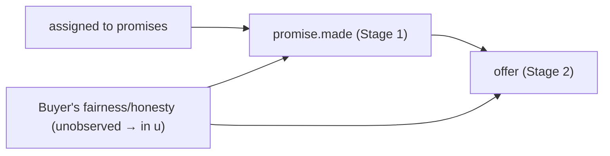
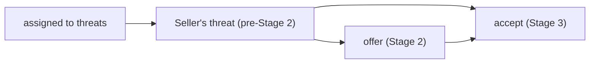

# 2023 Moed A — Holdup Game & Bargaining Behavior

> Part of: [[Econometrics]]
> **Final Exam 2023 — Moed A** — Applied Econometrics, Dr. Aluma Dembo
> Key concepts: [[_Econometrics Concepts#Linear Probability Model|Linear Probability Model]], [[_Econometrics Concepts#Dummy Variables|Dummy Variables]], [[_Econometrics Concepts#Robust Standard Errors|Robust Standard Errors]], [[_Econometrics Concepts#Hypothesis Testing|Hypothesis Testing]], [[_Econometrics Concepts#Logit Model|Logit Model]], [[_Econometrics Concepts#Marginal Effects|Marginal Effects]], [[_Econometrics Concepts#Maximum Likelihood Estimation|Maximum Likelihood Estimation]], [[_Econometrics Concepts#Causal Diagram|Causal Diagram]], [[_Econometrics Concepts#Endogeneity|Endogeneity]], [[_Econometrics Concepts#Omitted Variable Bias|Omitted Variable Bias]], [[_Econometrics Concepts#Instrumental Variables|Instrumental Variables]], [[_Econometrics Concepts#Instrument Validity|Instrument Validity]], [[_Econometrics Concepts#Instrument Relevance|Instrument Relevance]], [[_Econometrics Concepts#Endogenous Selection|Endogenous Selection]], [[_Econometrics Concepts#Ultimatum Game|Ultimatum Game]]
> Builds on: [[Lec_02-Linear Probability Model (LPM)]], [[Lec_03-Logit & Probit Models]], [[Lec_04-Instrumental Variables]]

---

## 📋 The Setup (read this first)

A Swedish lab experiment runs the **Holdup game** — the [[_Econometrics Concepts#Ultimatum Game|ultimatum game]] with an extra trust stage at the front. Each of **103 Buyer–Seller pairs** is randomly assigned to one of three communication conditions:

| Treatment | N | What's different |
| --------- | --- | ---------------- |
| **Control** | 40 | No communication |
| **Promises** | 30 | Buyer messages the Seller *before* Stage 1 (can promise a generous offer) |
| **Threats** | 33 | Seller messages the Buyer *before* Stage 2 (can threaten to reject low offers) |

The game runs in three stages, and **each stage produces one variable**:

- **Stage 1** — Seller chooses Invest / Don't invest → `invest`$_i$ (binary)
- **Stage 2** — Buyer proposes a split $x$ out of 100 → `offer`$_i$ (0–100, **NA if no invest**)
- **Stage 3** — Seller Accepts / Rejects → `accept`$_i$ (binary, **NA if no invest**)

> [!tip] The single most important observation
> Two of the three outcomes are **binary**: `invest` (Part A) and `accept` (Part C). So **every regression on those is a [[_Econometrics Concepts#Linear Probability Model|Linear Probability Model]]** — coefficients are changes in a *probability*, and you must use [[_Econometrics Concepts#Robust Standard Errors|heteroskedasticity-robust SEs]]. `offer` (Part B) is **continuous**, so model [2] is ordinary OLS. Spotting which is which tells you immediately how to read every coefficient and which SEs are needed.

> [!warning] The second thing that unlocks the paper — the sequential structure *is* the causal graph
> Because the stages happen in order, **earlier choices cause later ones**. The Seller's threat affects the Buyer's offer *and* the Seller's own acceptance; the Buyer's "fairness type" drives both what they promise and what they offer. That sequential structure is exactly why Parts B and C hinge on **[[_Econometrics Concepts#Endogeneity|endogeneity]]** and **[[_Econometrics Concepts#Causal Diagram|causal diagrams]]**, not just regression mechanics.

Every regressor here is a **[[_Econometrics Concepts#Dummy Variables|dummy]]** with **Control as the omitted base group**, so every treatment coefficient reads as "difference versus Control."

---

## Part A — Do promises affect the decision to invest? [Q1–Q2]

> Uses the **full** dataset (all 103 pairs). Outcome `invest` is binary → LPM and logit.

$$\text{Model [1]:}\quad \textit{invest}_i = \beta_0 + \beta_1\,\textit{promises}_i + \beta_2\,\textit{threats}_i + u_i$$

### Q1a — Interpreting $\beta_1,\beta_2$ and answering RQ (A) [20 pts]

> [!success] Answer
> Both coefficients are differences in the **probability of investing relative to the Control group** (the omitted dummy):
> - $\beta_1$ = change in P(invest) for a **promises**-treatment pair vs control.
> - $\beta_2$ = change in P(invest) for a **threats**-treatment pair vs control.
>
> The research question is specifically about *promises*, so we **test $H_0:\beta_1 = 0$** against $H_1:\beta_1\neq0$. Rejecting means promises shift the probability of investing.

> [!example] Why the coefficients *are* the group means
> With only dummies and control omitted, the fitted values are exactly the cell means: $\hat\beta_0=\overline{\textit{invest}}_{\text{control}}$, and $\hat\beta_0+\hat\beta_1=\overline{\textit{invest}}_{\text{promises}}$. Check against the data table: control invest rate $=14/40=0.350$, promises $=16/30=0.533$, threats $=21/33=0.636$ — these reproduce $0.350,\,0.350{+}0.183,\,0.350{+}0.286$ in the output below.

### Q1b — R pseudo-code [part of Q1]

```r
lpm = feols(invest ~ promises + threats, data = holdup, se = "hetero")
```

> [!success] Answer
> Because `invest` is binary this is an **[[_Econometrics Concepts#Linear Probability Model|LPM]]**, whose errors are **inherently [[_Econometrics Concepts#Heteroskedasticity|heteroskedastic]]** (the variance $p(1-p)$ depends on $x$). So we must request **[[_Econometrics Concepts#Robust Standard Errors|heteroskedasticity-robust]]** standard errors (`se = "hetero"`) or the inference is wrong.

### Q1c — Reading the output

```
              Estimate Std. Error t value  Pr(>|t|)
(Intercept)   0.350000   0.076538  4.57287 1.3809e-05 ***
promises      0.183333   0.120014  1.52760 1.2977e-01
threats       0.286364   0.114371  2.50381 1.3904e-02 *
```

> [!success] Answer — promises have **no detectable effect**
> The `promises` coefficient is **not** statistically significant: $p=0.130 > 0.05$ (also $|t|=1.53<1.96$). So even though the point estimate is +18.3 pp, we **cannot distinguish** the promises group's investment probability from control. **Conclusion: promises do not significantly affect the decision to invest.**
>
> *(Aside: `threats` is significant at 5%, $p=0.014$ — but that's not what RQ (A) asks.)*

![[PP02_invest_lpm.png|680]]

**Reading the figure.** Each bar is a group's invest rate, which equals the LPM's fitted value. The intercept is the control mean (0.350); each treatment coefficient is the *gap* up to that treatment's bar. The promises gap (+0.183) looks sizeable but its standard error is wide (0.120) → not significant. The threats gap (+0.286) is the one that clears the 5% bar.

> [!warning] Easy trap
> A non-significant coefficient does **not** mean "promises have zero effect." It means we **can't reject zero** at this sample size (only 30 promises pairs). With a positive point estimate and a wide SE, the honest statement is "no statistically significant effect," not "no effect."

### Q2a — The logit version [20 pts]

> [!success] Answer
> $$\mathbb{P}(\textit{invest}=1\mid x) = G\!\left(\beta_0 + \beta_1\,\textit{promises}_i + \beta_2\,\textit{threats}_i\right)$$
> where $G(\cdot)$ is the **logistic CDF** and $x$ collects the regressors. Unlike the LPM, $G$ squashes the linear index into $(0,1)$, so predicted probabilities are always valid. Estimated by **[[_Econometrics Concepts#Maximum Likelihood Estimation|maximum likelihood]]**. See [[Lec_03-Logit & Probit Models]].

### Q2b — Which line of code gives the marginal effect?

```r
coef(logit)                                          # option 1
dlogis( coef(logit) * averages )                     # option 2
coef(logit)*dlogis( sum( coef(logit) * averages ) )  # option 3  ✅
coef(logit)*dnorm(  sum( coef(logit) * averages ) )  # option 4
coef(logit)*plogis( sum( coef(logit) * averages ) )  # option 5
```

> [!success] Answer — **option 3**
> In logit the coefficient is **not** the [[_Econometrics Concepts#Marginal Effects|marginal effect]]. The effect of `promises` on P(invest) is
> $$g\!\left(\hat\beta_0 + \hat\beta_1\overline{\textit{promises}} + \hat\beta_2\overline{\textit{threats}}\right)\cdot\hat\beta_1$$
> i.e. **the logistic density $g(\cdot)$ evaluated at the linear index (using the sample-average $x$'s), times the coefficient**. Mapping to the code:
> - the index is `sum(coef(logit) * averages)` — a single number;
> - `dlogis(...)` is the logistic **density** $g$ (the right one — `dnorm` would be probit, `plogis` is the CDF not the density);
> - multiplying by `coef(logit)` gives the marginal effect for **each** variable.
>
> Option 3 is the only one that computes $g(\text{index})\cdot\hat\beta_j$. (Option 2 wrongly multiplies element-wise *inside* `dlogis` instead of summing to the index; options 4–5 use the wrong function.)

> [!tip] How to eliminate the distractors fast
> "Marginal effect of a logit = density × coefficient." The density of a **logistic** variable is `dlogis` → kills option 4 (`dnorm`) and option 5 (`plogis`, a CDF). The argument must be the **scalar index** `sum(coef·avg)` → kills option 2 (which feeds a *vector* into `dlogis`). What's left is option 3.

### Q2c — Advantage of logit over the LPM

> [!success] Answer
> The logit's fitted probabilities are **bounded in $(0,1)$** because the logistic CDF asymptotes at 0 and 1. The LPM is OLS on a binary outcome, so its linear fitted values are **unbounded** and can fall below 0 or above 1 — nonsensical for something we interpret as a probability. (Part C, Fig below, shows the LPM line literally crossing $P=1$.) See [[Lec_03-Logit & Probit Models]].

---

## Part B — How do threats & promises affect the offer? [Q3]

> Uses **only pairs whose Seller invested** (the 51 pairs with a non-NA `offer`). Outcome `offer` is continuous → plain OLS.

$$\text{Model [2]:}\quad \textit{offer}_i = \beta_0 + \beta_1\,\textit{promises}_i + \beta_2\,\textit{threats}_i + u_i$$

### Q3a — Reading the output at α = 5% and α = 10% [30 pts]

```
              Estimate Std. Error t value  Pr(>|t|)
(Intercept)    48.571      6.055   8.022  2.04e-10 ***
promises       21.429      8.291   2.584  0.0128   *
threats        14.762      7.817   1.888  0.0650   .
Residual standard error: 22.66 on 48 degrees of freedom
  (52 observations deleted due to missingness)
```

> [!success] Answer
> - **Promises: $\hat\beta_1 = 21.429$.** Significant at **both 5% and 10%** ($p=0.013$). Being in the promises treatment raises the Buyer's offer by **≈ 21.4 SEK** relative to control.
> - **Threats: $\hat\beta_2 = 14.762$.** **Not** significant at 5%, but **significant at 10%** ($p=0.065$). Being in the threats treatment raises the offer by **≈ 14.8 SEK** relative to control (weaker evidence).
> - Both communication channels **increase** the offer, with promises raising it slightly more. **Caveat:** we cannot test whether the *difference* between the two effects (21.4 vs 14.8) is significant from this output alone.

![[PP02_offer_treatment.png|680]]

**Reading the figure.** Each bar is a treatment's mean offer (= the model's fitted value); the intercept is the control mean (48.57), below the "fair" 60/40 split. Communication pushes offers **above** 60: promises to 70.0, threats to 63.3. The labels carry each coefficient and its significance tier so you can see at a glance which clears 5% (promises) and which only clears 10% (threats).

> [!warning] Why we condition on "invested only"
> `offer` is NA whenever the Seller didn't invest, so the 52 non-investing pairs drop out automatically — note "**52 observations deleted due to missingness**", leaving $51$ used ($103-52$). This is a *selected* subsample (only pairs that reached Stage 2), which is the seed of the selection worry that returns in Part C.

### Q3b — Why `promise.made` is endogenous (don't add it) [part of Q3]

A new variable `promise.made`$_i$ = the amount the Buyer *promised* before Stage 1. It is tempting to add it to model [2], but it is **endogenous**.

> [!success] Answer
> The Buyer's **unobserved propensity for fairness/honesty** drives **both** how much they *promise* (`promise.made`) **and** how much they actually *offer*. Since that propensity is unobserved it lives in the error term $u_i$. Therefore `promise.made` is correlated with $u_i$ — adding it violates the **exogeneity assumption** and produces **[[_Econometrics Concepts#Omitted Variable Bias|omitted-variable bias]]** in the treatment effect we care about. Keep it **out** of the model.



The confounder `fairness/honesty` has arrows into **both** `promise.made` and `offer` — controlling for `promise.made` would open a backdoor path through that unobserved type. See [[_Econometrics Concepts#Causal Diagram|Causal Diagram]], [[_Econometrics Concepts#Endogeneity|Endogeneity]].

> [!tip] Hand-drawable version (exam practice)
> In the exam you must *draw* this DAG. Here it is as an editable Excalidraw canvas — open it and redraw the confounder structure (red node feeding two arrows) until it's automatic. Red node = the unobserved type that makes `promise.made` endogenous.
>


---

## Part C — Does the offer affect the Seller's acceptance? [Q4]

> Uses **only pairs whose Seller invested**. Outcome `accept` is binary → LPM again.

$$\text{Model [3]:}\quad \textit{accept}_i = \beta_0 + \beta_1\,\textit{offer}_i + u_i$$

### Q4a — Endogeneity of `offer` and why threats isn't a valid IV [30 pts]

Consider the **threats** treatment, with the causal diagram: `threats → Seller's threat`; `Seller's threat → offer`; `Seller's threat → accept`; `offer → accept`.

> [!success] Answer (i) — `offer` is endogenous
> The **Seller's threat** (made before Stage 2) affects **both** the Buyer's `offer` **and** the Seller's own likelihood of accepting in Stage 3. Because the threat is unobserved it sits in the error of model [3]; since it also drives `offer`, we get $\text{Cov}(\textit{offer}, u)\neq0$ → **[[_Econometrics Concepts#Endogeneity|endogeneity]]**. OLS on model [3] is therefore biased.

> [!success] Answer (ii) — threats-assignment fails as an IV
> A valid [[_Econometrics Concepts#Instrumental Variables|instrument]] must satisfy **[[_Econometrics Concepts#Instrument Validity|validity]]** (the exclusion restriction): it may affect `accept` **only through** `offer`. But assignment to threats reaches `accept` through a **second channel** — `threats → Seller's threat → accept` — *not* routed through the offer. That extra path violates the exclusion restriction, so threats-assignment is **not a valid instrument** for `offer`. (Its relevance is fine; it's *validity* that fails.)



> [!tip] Hand-drawable version (exam practice)
> >
> The killer for the IV is the arrow `Seller's threat → accept` running **parallel** to the offer channel. An instrument is only valid if **every** path from it to the outcome passes through the endogenous regressor — here one doesn't.

### Q4b — Reading the control-group estimate

```
            Estimate Std. Error t value Pr(>|t|)
(Intercept) 0.334126  0.156049   2.141  0.05348 .
offer       0.009297  0.002706   3.436  0.00493 **
Residual standard error: 0.3147 on 12 degrees of freedom
  (26 observations deleted due to missingness)
Multiple R-squared: 0.4959,  Adjusted R-squared: 0.4539
```

> [!success] Answer
> The `offer` coefficient is $\hat\beta_1 = 0.0093$, significant at the 1% level ($p=0.005$). Interpreting the LPM: a **10-SEK higher offer raises the probability the Seller accepts by ≈ 9.3 pp**. So within the control group, more generous offers are accepted more often.

![[PP02_accept_lpm.png|640]]

The fitted LPM line climbs at 0.93 pp per SEK; the orange step shows the +10 SEK → +9.3 pp reading. Note the line **crosses $P=1$** at high offers — the LPM boundedness problem from Q2c made concrete.

> [!warning] What to be worried about — tiny, *selected* sample
> The regression runs on **only 14 observations**: of the 40 control pairs, in **26 the Seller didn't invest**, so `accept`/`offer` are NA and drop out. Two concerns:
> 1. **Tiny n (14)** → imprecise, fragile estimates.
> 2. **[[_Econometrics Concepts#Endogenous Selection|Endogenous selection]]** → the Sellers who chose to invest are not random. Something about them (e.g. a disposition to accept even small offers) may drive *both* their Stage-1 investment *and* their Stage-3 acceptance, biasing $\hat\beta_1$. We're estimating the offer→accept relationship on a self-selected subset, so it may not generalise.

---

## 🧠 One-page recap (what each part tests)

| Q | Tool | Answer in one line |
| --- | --- | --- |
| 1a | [[_Econometrics Concepts#Dummy Variables|Dummy interpretation]] | $\beta_1,\beta_2$ = P(invest) gap vs control; test $H_0:\beta_1=0$ |
| 1b | [[_Econometrics Concepts#Linear Probability Model|LPM]] + [[_Econometrics Concepts#Robust Standard Errors|robust SE]] | `feols(invest ~ promises + threats, se="hetero")` |
| 1c | [[_Econometrics Concepts#Hypothesis Testing|Inference]] | promises p=0.130 → **no significant effect** on investing |
| 2a | [[_Econometrics Concepts#Logit Model|Logit]] | $\mathbb{P}(\textit{invest})=G(\beta_0+\beta_1 prom+\beta_2 thr)$, $G$ = logistic CDF |
| 2b | [[_Econometrics Concepts#Marginal Effects|Marginal effect]] | **Option 3**: $g(\text{index})\cdot\hat\beta$ via `dlogis(sum(coef·avg))` |
| 2c | LPM vs logit | logit keeps $\hat P\in(0,1)$; LPM predictions unbounded |
| 3a | OLS on continuous `offer` | promises +21.4 (sig 5%); threats +14.8 (sig 10% only) |
| 3b | [[_Econometrics Concepts#Omitted Variable Bias|OVB]] / [[_Econometrics Concepts#Causal Diagram|DAG]] | fairness type → promise.made & offer ⇒ `promise.made` endogenous |
| 4a | [[_Econometrics Concepts#Instrument Validity|IV validity]] | threat confounds offer→accept; threats-assignment has 2nd path ⇒ invalid IV |
| 4b | [[_Econometrics Concepts#Endogenous Selection|Endogenous selection]] | offer +9.3 pp/10 SEK (p=0.005) but **n=14**, self-selected |

---

## 📎 Related Notes

- Foundational: [[Lec_02-Linear Probability Model (LPM)]] · [[Lec_03-Logit & Probit Models]] · [[Lec_04-Instrumental Variables]]
- Sister past paper: [[PP_01-Emotions & Risky Choice (Practice Exam)]] (same instructor — LPM/probit, DAGs, IV, DiD)
- Applied practice: [[PS_05-Labor Unions & Product Recalls]] (LPM & omitted-variable bias) · [[PS_02-Fertility & Education]] (IV validity & selection)
- Concepts: [[_Econometrics Concepts#Linear Probability Model|Linear Probability Model]] · [[_Econometrics Concepts#Marginal Effects|Marginal Effects]] · [[_Econometrics Concepts#Endogeneity|Endogeneity]] · [[_Econometrics Concepts#Instrument Validity|Instrument Validity]] · [[_Econometrics Concepts#Endogenous Selection|Endogenous Selection]]
- Hub: [[Econometrics]]
