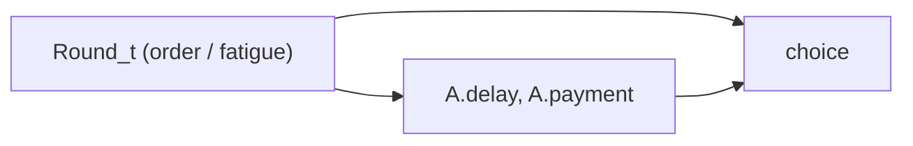
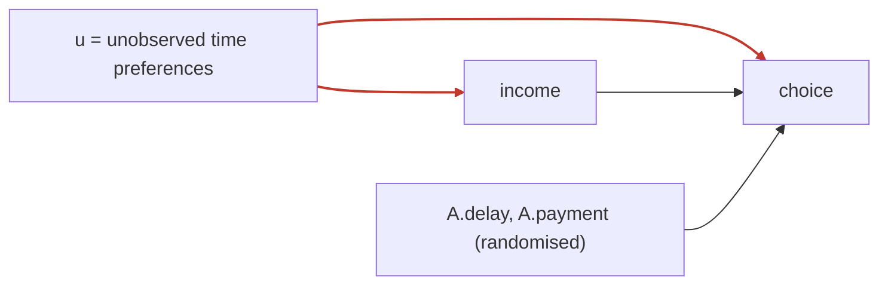

# 2023 Moed B — Time Preferences & Discounting

> Part of: [[Econometrics]]
> **Final Exam 2023 — Moed B** — Applied Econometrics, Dr. Aluma Dembo
> Key concepts: [[_Econometrics Concepts#Hypothesis Testing|Hypothesis Testing]], [[_Econometrics Concepts#Omitted Variable Bias|Omitted Variable Bias]], [[_Econometrics Concepts#Serial Correlation|Serial Correlation]], [[_Econometrics Concepts#Fixed Effects|Fixed Effects]], [[_Econometrics Concepts#Individual Fixed Effect|Individual Fixed Effect]], [[_Econometrics Concepts#Within Estimator|Within Estimator]], [[_Econometrics Concepts#Clustered Standard Errors|Clustered Standard Errors]], [[_Econometrics Concepts#Causal Diagram|Causal Diagram]], [[_Econometrics Concepts#Endogeneity|Endogeneity]], [[_Econometrics Concepts#Instrumental Variables|Instrumental Variables]], [[_Econometrics Concepts#Two Stage Least Squares|Two Stage Least Squares]], [[_Econometrics Concepts#First Stage|First Stage]], [[_Econometrics Concepts#Second Stage|Second Stage]], [[_Econometrics Concepts#Instrument Validity|Instrument Validity]], [[_Econometrics Concepts#Instrument Relevance|Instrument Relevance]], [[_Econometrics Concepts#Weak Instruments|Weak Instruments]], [[_Econometrics Concepts#Overidentifying Restrictions Test|Overidentifying Restrictions Test]], [[_Econometrics Concepts#Wu-Hausman Test|Wu-Hausman Test]], [[_Econometrics Concepts#Linear Probability Model|Linear Probability Model]], [[_Econometrics Concepts#Robust Standard Errors|Robust Standard Errors]], [[_Econometrics Concepts#Difference-in-Differences|Difference-in-Differences]], [[_Econometrics Concepts#Parallel Trends Assumption|Parallel Trends Assumption]]
> Builds on: [[Lec_04-Instrumental Variables]], [[Lec_08-Fixed Effects in Panel Data]], [[Lec_02-Linear Probability Model (LPM)]], [[Lec_10-Difference-in-Differences]]

---

## 📋 The Setup (read this first)

A **lab-in-field experiment** measures **time preferences** of 178 subjects across 9 rural Vietnamese villages (2005). In each of **15 rounds** a subject chooses between **Plan A** (a larger payment after a delay) and **Plan B** (a smaller payment today). Each round fixes a `A.payment` (30k–300k VND) and a `A.delay` (3–90 days); within the round, five questions vary how much of Plan A is offered today (⅙ → ⅚).

The dataset `panel.data` is a **panel**: 178 subjects × 15 rounds = **2,670 obs**. The three outcome variables encode the same choice at different resolutions:

| Variable | Type | Meaning |
| --- | --- | --- |
| `choice`$_{it}$ | **continuous** (0 → ⅚) | fraction of the future payment the subject will forgo to be paid today. Higher = more impatient. |
| `today.always`$_{it}$ | **binary** | =1 if subject took Plan B (today) on *all five* questions that round |
| `delay.always`$_{it}$ | **binary** | =1 if subject took Plan A (delay) on *all five* questions that round |

> [!tip] The single most important observation
> **Which outcome a question uses tells you the model.** `choice` is continuous → ordinary **OLS** (Parts A & B). `today.always` is binary → every regression on it is a **[[_Econometrics Concepts#Linear Probability Model|Linear Probability Model]]** with **[[_Econometrics Concepts#Robust Standard Errors|heteroskedasticity-robust SEs]]** (Parts C & the DiD in Q4). Spot the outcome type first and you instantly know how to read every coefficient.

> [!warning] The second unlocking idea — what's randomised vs what's observed
> `A.delay` and `A.payment` are **set by the researcher** each round, so they are **exogenous** — clean regressors. But `income` is a **survey covariate** from 2002, not randomised, so it is **[[_Econometrics Concepts#Endogeneity|endogenous]]** (Part B → needs **[[_Econometrics Concepts#Instrumental Variables|IV]]**). And because it's a **panel**, the round index and each subject's fixed traits lurk in the error → **[[_Econometrics Concepts#Omitted Variable Bias|OVB]]** / **[[_Econometrics Concepts#Fixed Effects|fixed effects]]** (Part A). The whole paper is a tour of *why the error term is contaminated* and the matching fix.

---

## Part A — Does a higher time delay cause higher choice? [Q1, 25 pts]

> Outcome `choice` is continuous → OLS. RQ (A): *does a longer delay make people prefer money today?*

### Q1a — Baseline model & null hypothesis [5 pts]

> [!success] Answer
> $$choice_{it} = \beta_0 + \beta_1\,A.delay_t + \beta_2\,A.payment_t + u_{it}$$
> To answer RQ (A) we test
> $$H_0:\beta_1 = 0 \quad\text{against}\quad H_1:\beta_1 \neq 0.$$
> If a longer delay makes people more impatient we expect $\beta_1>0$; rejecting $H_0$ answers the question.

> [!warning] Two easy marks people drop
> Include the **random error** $u_{it}$ and use the **$it$ subscripts** (it's panel data). The official grader docks a point for either omission.

### Q1b — Order effects [10 pts]

The worry: in multi-round experiments the **round order itself** (fatigue, learning) can shift behaviour — "order effects". Note that $Round_t$ is **not** in the baseline model.

> [!success] Answer
> In the baseline model $Round_t$ is hiding in the **random error** $u_{it}$. Round is correlated with the regressors (each round has its own `A.delay`/`A.payment`) **and**, under order effects, it directly affects `choice`. A variable that sits in the error while correlating with a regressor is the definition of an **[[_Econometrics Concepts#Omitted Variable Bias|omitted variable]]** — so $\hat\beta_1$ is **biased**. The same omitted $Round_t$ also makes the errors **[[_Econometrics Concepts#Serial Correlation|serially correlated]]** across a subject's rounds.
>
> **Fix — put $Round_t$ in the model:**
> $$choice_{it} = \beta_0 + \beta_1 A.delay_t + \beta_2 A.payment_t + \beta_3 Round_t + u_{it}$$
> Controlling for $Round_t$ removes both problems at once. With the omitted variable now included the errors are no longer serially correlated, so **ordinary OLS standard errors are fine** — no special correction needed.



The backdoor `A.delay ← Round → choice` is exactly the OVB path; adding $Round_t$ blocks it. See [[_Econometrics Concepts#Omitted Variable Bias|OVB]], [[_Econometrics Concepts#Serial Correlation|Serial Correlation]].

### Q1c — Controlling for subject differences with heteroskedastic-by-subject errors [10 pts]

The ask: (i) improve fit by controlling for **differences between subjects**, and (ii) allow the **error variance to differ by subject**.

> [!success] Answer
> Add **[[_Econometrics Concepts#Individual Fixed Effect|individual fixed effects]]** (a dummy per subject) to absorb time-invariant differences between people, and **[[_Econometrics Concepts#Clustered Standard Errors|cluster the standard errors at the subject level]]** to allow each subject's errors their own variance/correlation.

```r
# Option 1 — explicit dummies, then cluster the SEs by subject
fe1 = feols(choice ~ A.delay + A.payment + factor(id), data = panel.data)
summary(fe1, cluster = ~ id)

# Option 2 — within-estimation; clusters SEs at the FE level automatically
fe2 = feols(choice ~ A.delay + A.payment | id, data = panel.data)
summary(fe2)
```

> [!example] Why this is the right tool
> Differences *between subjects* are a per-person intercept $a_i$. The **[[_Econometrics Concepts#Within Estimator|within estimator]]** (`| id`) demeans each subject, so $a_i$ drops out and $\beta_1$ is identified from **within-subject** variation only — and `feols` then clusters by `id` for free. Clustering is what "lets the error variance differ by subject": it permits arbitrary within-subject variance and correlation.

![[PP03_fixed_effects.png|660]]

**Reading the figure.** Each colour is a subject. Fixed effects let every subject keep their **own intercept** (patient vs impatient baseline) while sharing the **same slope** $\beta_1$ — the line's tilt, estimated from how each person moves with `A.delay`, is the causal object we want.

> [!warning] Own intercept — **not** own slope
> A common slip: thinking FE gives each subject their own intercept *and* their own gradient. It only shifts **intercepts**. The **slope $\beta_1$ is shared** by everyone (one tilt for all the lines below) — that single common tilt *is* the coefficient we're estimating. Letting each person have their own slope would be a different model (interaction terms), not fixed effects.

> [!example] What the code actually does (the within estimator)
> `feols(... | id)` does **not** average 178 separate slopes. It **demeans**: for each subject it subtracts that subject's own mean of `choice`, `A.delay`, `A.payment` — annihilating the intercept and every time-invariant trait — then runs **one** OLS on the re-centred data. So $\beta_1$ is identified purely from **within-subject** variation (how *your own* choice moves as *your own* delay changes), pooled into a single estimate. `feols(... | factor(id))` (fe1) instead prints all 178 dummy intercepts and you cluster the SEs by hand; the two give **identical** slopes and clustered SEs — fe2 is just the tidy readout that absorbs the intercepts.

**Without FE, the same data looks like this** — one pooled line ignores who each point belongs to, so the between-subject level gaps explode into residual scatter (left); FE re-centres each subject and the fit tightens onto parallel lines with one shared slope (right):

![[PP03_pooled_vs_fe.png|720]]

---

## Part B — Does lower income cause higher choice? [Q2, 40 pts]

> Outcome still continuous (`choice`). The colleague's model adds `income`:
> $$choice_{it} = \beta_0 + \beta_1 A.delay_t + \beta_2 A.payment_t + \beta_3\,income_i + u_{it}$$
> Worry: unobserved **time preferences** are correlated with **income** → `income` endogenous.

### Q2a — Causal diagram for income endogeneity [15 pts]

> [!success] Answer
> A subject's **unobserved time preferences** live in the error $u_{it}$. They affect **choice directly** (impatient people forgo more future money) *and* they affect **income** (e.g. impatient people save/invest less, earning less). So `income` is correlated with $u_{it}$ — a violation of **exogeneity** ($\text{Cov}(income,u)\neq0$) → **[[_Econometrics Concepts#Endogeneity|endogeneity]]**, and OLS on $\beta_3$ is biased. `A.delay` and `A.payment` are randomly assigned by the researcher, so they are unaffected by income or preferences (though they still cause `choice`).



> [!tip] Hand-drawable version (exam practice)
> You must *draw* this DAG in the exam. Here it is as an editable Excalidraw canvas — open it and redraw until the structure is automatic. The red node `u` feeding **two** arrows (into `income` **and** `choice`) is what makes `income` endogenous.
>
> 
### Q2b — IV / 2SLS estimate [10 pts]

Instruments: `hsheadnowork`$_i$ and `avg.vilg.rainfall`$_i$ (both from the 2002 survey). Two instruments for one endogenous regressor → **overidentified**.

**First stage** — Dep. var.: `income`:

```
                   Estimate   Std. Error  t value    Pr(>|t|)
(Intercept)        -3.155679    2.162945   -1.459    0.1447
avg.vilg.rainfall   0.016315    0.001370   11.913    < 2.2e-16 ***
hsheadnowork      -13.253520    2.046885   -6.475    1.13e-10 ***
A.delay            ~0           0.012284    ~0        1.0000
A.payment          ~0           0.0000038   ~0        1.0000
---
F-test (1st stage): stat = 97.0, p < 2.2e-16
```

**Second stage** — Dep. var.: `choice`:

```
              Estimate     Std. Error   t value   Pr(>|t|)
(Intercept)   0.467936     0.024722     18.928    < 2.2e-16 ***
fit_income   -0.004901     0.001069     -4.583    4.80e-06 ***
A.delay       0.002728     0.000183     14.900    < 2.2e-16 ***
A.payment    -2.12e-07     5.09e-07     -3.732    1.94e-04 ***
---
Wu-Hausman: stat = 15.0, p = 1.08e-4    Sargan: stat = 9.603, p = 0.00194
```

> [!success] Answer — the colleague is right
> Look at **`fit_income`** in the second stage: $\hat\beta_3 = -0.00490$, **statistically significant** ($p = 4.80\text{e-}06 \ll 0.05$). The sign is **negative**: a **1-million-VND fall in income raises `choice` by ≈ 0.005**, i.e. the subject will forgo about **0.5% more** of the future payment. So **lower income does cause a stronger preference for money today** — the colleague's suspicion is confirmed.

![[PP03_iv_income_choice.png|660]]

**Reading the figure.** The 2SLS line slopes **down**: instrumented income vs predicted choice. The strong first stage ($F=97$) means the instruments inject plenty of exogenous variation in income, so this slope is well-identified.

> [!example] Why we trust the first stage
> A valid 2SLS needs a **strong [[_Econometrics Concepts#First Stage|first stage]]**. Here the joint $F = 97 \gg 10$, so these are **not [[_Econometrics Concepts#Weak Instruments|weak instruments]]**. The **[[_Econometrics Concepts#Wu-Hausman Test|Wu–Hausman]]** test also rejects ($p=1.08\text{e-}4$), confirming income really was endogenous and IV was needed over OLS.

### Q2c — Validity & relevance of the two instruments [15 pts]

> [!success] Answer — Relevance ✅ (testable)
> **Relevance** requires the instruments to move `income` ($\text{Cov}(z,income)\neq0$) — and we can **test it directly** in the first stage. Both clear the bar at 5%: `avg.vilg.rainfall` ($p<2.2\text{e-}16$, **positive** — wetter villages are richer) and `hsheadnowork` ($p=1.13\text{e-}10$, **negative** — a household head unable to work means lower income). Joint $F=97$ confirms **[[_Econometrics Concepts#Instrument Relevance|relevance]]**. Both were measured in the **same 2002 survey** as income, which is why they predict it well.

> [!success] Answer — Validity ✅ (argued, not tested)
> **[[_Econometrics Concepts#Instrument Validity|Validity]]** (the exclusion restriction) requires the instruments to be **uncorrelated with the error** — to affect `choice` *only through* `income`. We can't prove this, but the **timing** makes a strong case: the instruments are from **2002**, the choices were made in **2005**. Whether a household head couldn't work for 7 days in 2002, or how much rain fell in 2002, has **no plausible direct channel** to a money-vs-time choice three years later — except through its effect on income. So the exclusion restriction is credible.

> [!warning] Subtlety the official answer skips — the Sargan test actually *rejects*
> Because the model is **overidentified** (2 instruments, 1 endogenous regressor), validity is **partially testable** via the **[[_Econometrics Concepts#Overidentifying Restrictions Test|Sargan overidentification test]]** in the output. Here Sargan $=9.60$, **$p=0.00194 < 0.05$**, so we **reject** the joint null that *both* instruments are valid. The honest reading: at least one instrument may violate the exclusion restriction (e.g. rainfall could affect current liquidity/consumption directly, not only via 2002 income). The conceptual timing argument is the expected exam answer, but a careful student notes the Sargan flag. (The test assumes ≥1 instrument is valid; it can't tell us *which* one fails.)

---

## Part C — Does a higher Plan A payment change P(always pick today)? [Q3–Q4]

> Outcome `today.always` is **binary** → LPM with robust SEs.

### Q3 — Effect of `A.payment` on `today.always` [10 pts]

```
OLS estimation, Dep. var.: today.always   (Std-errors: Heteroskedasticity-robust)
              Estimate     Std. Error   t value   Pr(>|t|)
(Intercept)   0.208981     0.017323     12.064    < 2.2e-16 ***
A.delay       0.003093     0.000271     11.403    < 2.2e-16 ***
A.payment    -2.68e-07     8.19e-08     -3.276    0.00107   **
```

> [!success] Answer — yes, a higher payment *lowers* P(always pick today)
> The coefficient on **`A.payment` is $-2.68\text{e-}07$**, **statistically significant** ($p = 0.00107 \ll 0.05$). Reading it as an **[[_Econometrics Concepts#Linear Probability Model|LPM]]**: raising Plan A by **30,000 VND** (one step on the payment grid) changes P(always choose Plan B today) by $30{,}000 \times (-2.68\text{e-}07) = -0.00804$, i.e. **−0.8 percentage points**. A bigger future prize makes subjects **less** likely to grab the immediate cash every time — exactly as economic intuition predicts.

![[PP03_lpm_payment.png|660]]

**Reading the figure.** The downward LPM line is P(`today.always`=1) against `A.payment`; the orange arrow shows the +30,000 → −0.8 pp reading. The fitted value *is* a predicted probability — the LPM interpretation.

> [!tip] Easy aside (don't forget `A.delay`)
> `A.delay` is also significant and **positive** ($+0.0031$, $p<2.2\text{e-}16$): a longer delay raises the probability of always taking money today. Same story as Part A, now on the binary margin — consistent evidence that delay drives impatience.

> [!warning] Tiny number-check discrepancy
> The official write-up quotes the `A.payment` p-value as **0.000975**; the printed output reads **0.00107**. Either way it's far below 0.05, so the conclusion (significant, negative) is unchanged.

### Q4 — DiD robustness check: did the typhoon warning affect choices? [25 pts]

Backstory: in village **N3** a typhoon alarm interrupted the session **right after round 6**. Nearby village **N4** (same province) ran a few days earlier with **no** interruption. The colleague runs a **[[_Econometrics Concepts#Difference-in-Differences|difference-in-differences]]** check:
$$today.always_{it} = \beta_0 + \beta_1 treatment_i + \beta_2 post_t + \beta_3 effect_{it} + u_{it}$$

#### Q4a — Define the groups & write the R code [15 pts]

> [!success] Answer
> - **Treatment group** = subjects in **N3** (the village hit by the typhoon warning). **Control group** = subjects in **N4**.
> - **Pre-period** = rounds **1–5** (before the alarm). **Post-period** = rounds **6–15** (after).
> - `effect` is the DiD interaction (group × period); its coefficient $\beta_3$ is the typhoon effect.

```r
# Treated = N3 (the typhoon village); control = N4.
# Post = from round 6 onward (the alarm hit right after round 6).
panel.data$treatment = as.numeric( panel.data$village == "N3" )
panel.data$post      = as.numeric( panel.data$round  >= 6  )
panel.data$effect    = panel.data$treatment * panel.data$post   # DiD interaction

DID1 = lm(today.always ~ treatment + post + effect, data = panel.data,
          subset = panel.data$village %in% c("N3", "N4"))
summary(DID1)
```

> [!tip] Why this coding is the one to reproduce
> Each variable means exactly what it says: `treatment` = the group that *received* the shock (N3), `post` = the periods *after* it (rounds 6–15), and `effect = treatment × post`. With this setup a **positive `effect`** would say the typhoon *raised* `today.always`, a negative one that it *lowered* it — the sign reads straight off. The DiD estimate you interpret is always the **interaction $\beta_3$**, never the two main effects (which just set the group gap and the common time trend).

#### Q4b — Read the output [10 pts]

```
              Estimate   Std. Error  t value   Pr(>|t|)
(Intercept)   0.21000    0.04590      4.575    4.76e-06 ***
treatment     0.05666    0.06215      0.912    0.362
post          0.11500    0.05622      2.046    0.041    *
effect       -0.03583    0.07612     -0.471    0.638
```

> [!success] Answer — no, the typhoon warning had no detectable effect
> Read the **interaction `effect` = $-0.0358$** — the DiD estimate. It is **not** statistically significant ($p = 0.638 \gg 0.05$), so we **cannot reject** that the typhoon warning had zero effect on choices. The colleague's robustness check passes — the interruption does **not** appear to have changed behaviour.
>
> *(The main effects are just scaffolding: `post = +0.115` is the common upward time trend both villages share — note rounds 6–15 use larger/longer Plan A offers — and `treatment = +0.057` is N3's baseline gap above N4. Neither answers the research question; only the interaction does.)*

![[PP03_did_plot.png|660]]

**Reading the figure.** N3 (treated) and N4 (control) both drift **up** from pre to post. The dashed line is N3's counterfactual under **[[_Econometrics Concepts#Parallel Trends Assumption|parallel trends]]** (N3's pre-level + N4's change). The DiD is the gap between N3's actual post-point and that counterfactual — small (−0.036) and statistically indistinguishable from zero.

---

## 🧠 One-page recap (what each part tests)

| Q | Tool | Answer in one line |
| --- | --- | --- |
| 1a | Baseline OLS + [[_Econometrics Concepts#Hypothesis Testing|H-test]] | `choice = β₀+β₁delay+β₂payment+u`; test $H_0:\beta_1=0$ |
| 1b | [[_Econometrics Concepts#Omitted Variable Bias|OVB]] + [[_Econometrics Concepts#Serial Correlation|serial corr.]] | `Round` is in the error → add it; then plain OLS SEs are fine |
| 1c | [[_Econometrics Concepts#Individual Fixed Effect|Individual FE]] + [[_Econometrics Concepts#Clustered Standard Errors|cluster]] | `feols(choice ~ delay+payment | id)` — within-est., clustered by `id` |
| 2a | [[_Econometrics Concepts#Causal Diagram|Causal DAG]] | time prefs `u` → income & choice ⇒ income [[_Econometrics Concepts#Endogeneity|endogenous]] |
| 2b | [[_Econometrics Concepts#Two Stage Least Squares|2SLS]] | `fit_income = −0.0049***` ⇒ lower income → higher choice |
| 2c | [[_Econometrics Concepts#Instrument Validity|Validity]] & [[_Econometrics Concepts#Instrument Relevance|relevance]] | relevant (1st-stage F=97); valid by 2002-vs-2005 timing — but **Sargan rejects** |
| 3 | [[_Econometrics Concepts#Linear Probability Model|LPM]] | `A.payment = −2.68e-07**` ⇒ +30k → −0.8 pp P(today.always) |
| 4a | [[_Econometrics Concepts#Difference-in-Differences|DiD]] setup | treat=N3, control=N4; pre=rounds 1–5, post=6–15; `effect`=interaction |
| 4b | DiD inference | `effect = −0.036` ($p=0.638$) ⇒ no typhoon effect |

---

## 📎 Related Notes

- Foundational: [[Lec_04-Instrumental Variables]] · [[Lec_08-Fixed Effects in Panel Data]] · [[Lec_02-Linear Probability Model (LPM)]] · [[Lec_10-Difference-in-Differences]]
- Sister past papers: [[PP_02-Holdup Game & Bargaining (2023 Moed A)]] (the Moed A twin — LPM, DAGs, IV validity) · [[PP_01-Emotions & Risky Choice (Practice Exam)]] (FE, LPM vs probit, DiD, IV)
- Applied practice: [[PS_02-Fertility & Education]] (IV validity & 2SLS) · [[PS_04-Seatbelt Laws & Traffic Fatalities]] (panel FE & clustered SEs)
- Concepts: [[_Econometrics Concepts#Instrumental Variables|Instrumental Variables]] · [[_Econometrics Concepts#Fixed Effects|Fixed Effects]] · [[_Econometrics Concepts#Linear Probability Model|Linear Probability Model]] · [[_Econometrics Concepts#Difference-in-Differences|Difference-in-Differences]]
- Hub: [[Econometrics]]
